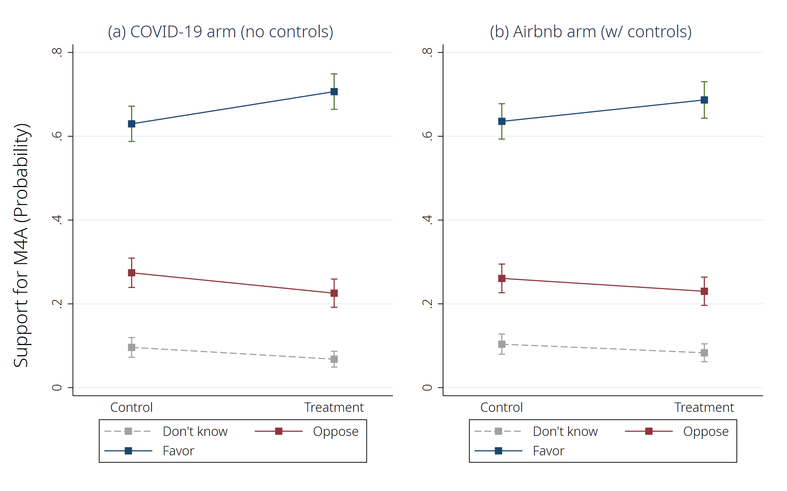
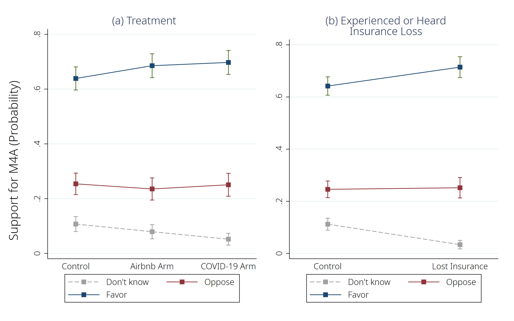

# How is COVID-19 Associated Job-loss affecting Support for Medicare for All?

*Paper Authors: Ashley M Fox, Yongjin Choi, Heather Lanthorn, and Kevin Croke </br> Script Author: Yongjin Choi* </br> *Last updated: Dec. 13. 2020*

* What's Included
	- [Part I. Basic Setting](#part-i-basic-setting)
	- [Part II. Data Prep](#part-ii-data-prep)
	- [Part III. Analysis](#part-iii-Analysis)

## Part I. Basic Setting

### Delimiter, working directory, and description option


```stata
********************************************************************************
/*----- Basic Setting -----*/
********************************************************************************

/*----- Essentials -----*/
// Initializing, delimiter, and working directory
#delimit cr
clear all
cd "C:\Users\NoMoreTicket\OneDrive - University at Albany - SUNY\05.Research\2019_Framing Single-Payer\06.Submission\JHPPL"
set more off

// Output width
set linesize 240
display "{hline}"

// Color scheme for plots
set scheme s2color
grstyle init
grstyle color background white
```

    
    delimiter now cr
    
    C:\Users\NoMoreTicket\OneDrive - University at Albany - SUNY\05.Research\2019_Framing Single-Payer\06.Submission\JHPPL
    
    
    
    ------------------------------------------------------------------------------------------------------------------------------------------------------------------------------------------------------------------------------------------------
    
    
    
    

### (Optional) Packages required


```stata
/*----- (Optional) Installing Packages -----*/
//ssc install estout, replace;
//ssc install catplot, replace;
//ssc install coefplot, replace;
//ssc install tabout, replace;
//ssc install grstyle, replace;
//ssc install palettes, replace;
```

## Part II. Data Prep


```stata
********************************************************************************
/*----- Data Prep -----*/
********************************************************************************

/*----- Simply, loading a cleaned dta from COVID_Survey Data_analysis_Qualtrics_sample_only -----*/
use "COVID_Survey Data_analysis_Qualtrics_sample_only", clear

// Variables
gen treatment = cond(COVID_arm_dummy == 1, 2, cond(Airbnb_arm_dummy == 1, 1, 0))
tab treatment
capture label var treatment "Treatment";
capture label define treatment 0 "Control" 1 "Airbnb Arm" 2 "COVID-19 Arm";
capture label values treatment treatment;

// Labeling
label var COVID_arm_dummy "COVID-19 Study Arm (Arm 1)"
label var Airbnb_arm_dummy "Airbnb Study Arm (Arm 2)"
label var female "Female"
```

    
    
    
    
      treatment |      Freq.     Percent        Cum.
    ------------+-----------------------------------
              0 |        491       35.10       35.10
              1 |        452       32.31       67.41
              2 |        456       32.59      100.00
    ------------+-----------------------------------
          Total |      1,399      100.00
    
    
    
    
    
    
    

## Part III. Analysis

### Table 1


```stata
/*----- Table 1 -----*/
tab support_M4A_likert
```

    
    RECODE of HR_08 |
            (HR_08) |      Freq.     Percent        Cum.
    ----------------+-----------------------------------
     Strongly Favor |        442       36.50       36.50
     Somewhat Favor |        372       30.72       67.22
    Somewhat Oppose |        164       13.54       80.76
    Strongly Oppose |        135       11.15       91.91
         Don't know |         98        8.09      100.00
    ----------------+-----------------------------------
              Total |      1,211      100.00
    

### Table 2


```stata
/*----- Table 2 -----*/
tab HR_11
```

    
          HR_11 |      Freq.     Percent        Cum.
    ------------+-----------------------------------
              1 |        451       37.24       37.24
              4 |        534       44.10       81.34
              5 |        192       15.85       97.19
              6 |         34        2.81      100.00
    ------------+-----------------------------------
          Total |      1,211      100.00
    

### Table 3


```stata
/*----- Table 3 -----*/
sum HR01new_reverse_code, detail
```

    
                   RECODE of HR_01_NEW (HR_01_NEW)
    -------------------------------------------------------------
          Percentiles      Smallest
     1%            1              1
     5%            2              1
    10%            2              1       Obs               1,211
    25%            4              1       Sum of Wgt.       1,211
    
    50%            7                      Mean           6.548307
                            Largest       Std. Dev.      3.127316
    75%           10             10
    90%           10             10       Variance       9.780103
    95%           10             10       Skewness      -.3422122
    99%           10             10       Kurtosis       1.609382
    

### Table 4


```stata
/*----- Table 4 -----*/
// w/controls and nocontrols columns were switched

eststo clear
eststo m1: qui ologit support_M4A_DK COVID_arm_dummy
eststo m2: qui ologit support_M4A_DK COVID_arm_dummy i.Party_ID female i.age_cat i.race_cat i.income_cat
eststo mfx2: qui margins, at(COVID_arm_dummy=(0/1)) vsquish
qui marginsplot, ytitle("", margin(small)) xtitle("") title("(a) COVID-19 arm (no controls)") name(g2, replace)/*
               */plot(, label("Don't know" "Oppose" "Favor"))/*
               */xsize(8) ysize(5)/*
               */plot1opts(mcolor(gs10) lcolor(gs10) lpattern("--") msymbol(square))/*
               */ci1opts(color(gs10))/*
               */plot2opts(pstyle(p2) msymbol(square))/*
               */plot3opts(pstyle(p1) msymbol(square))/*
               */xlab(-.25 " " 0 "Control" 1 "Treatment" 1.25 " ", notick)

eststo m3: qui ologit support_M4A_DK Airbnb_arm_dummy
eststo m4: qui ologit support_M4A_DK Airbnb_arm_dummy i.Party_ID female i.age_cat i.race_cat i.income_cat
eststo mfx4: qui margins, at(Airbnb_arm_dummy=(0 1)) vsquish
qui marginsplot, ytitle("", margin(small)) xtitle("") title("(b) Airbnb arm (w/ controls)") name(g4, replace)/*
               */plot(, label("Don't know" "Oppose" "Favor"))/*
               */xsize(8) ysize(5)/*
               */plot1opts(mcolor(gs10) lcolor(gs10) lpattern("--") msymbol(square))/*
               */ci1opts(color(gs10))/*
               */plot2opts(pstyle(p2) msymbol(square))/*
               */plot3opts(pstyle(p1) msymbol(square))/*
               */xlab(-.25 " " 0 "Control" 1 "Treatment" 1.25 " ", notick)

qui graph combine g2 g4, l1("Support for M4A (Probability)") ycommon xsize(8) ysize(5)
graph save "C:\Users\NoMoreTicket\OneDrive - University at Albany - SUNY\05.Research\2019_Framing Single-Payer\06.Submission\JHPPL\STATA_Outputs\Table4.grh", replace
graph export "C:\Users\NoMoreTicket\OneDrive - University at Albany - SUNY\05.Research\2019_Framing Single-Payer\06.Submission\JHPPL\STATA_Outputs\Table4.png", replace


esttab m1 m2 mfx2 m3 m4 mfx4 /*
    //using "C:\Users\NoMoreTicket\OneDrive - University at Albany - SUNY\05.Research\2020_Media Consumption and Social Distancing\02.STATA Outputs\Appendix2.rtf"
    */,replace b(2) ci(3) r2(3) ar2(3) scalar(F) /*
    */order(COVID_arm_dummy Airbnb_arm_dummy) /*
    */title(Table 4. Ordered Logit) /*
    */nonumbers /*
    */mgroups("COVID-19 Arm" "Airbnb Arm", pattern(1 0 0 1 0 0)) /*
    */mtitles("No controls" "w/ controls" "Margins" "No controls" "w/ controls" "Margins") /*
    */addnote("Controls included but not shown (gender, race, income, party ID)") /*
    */label /*
    */nobaselevels /*
    */interaction(" X ") /*
    */varwidth(25) modelwidth(15) compress /*
    */star(* 0.1 ** 0.05 *** 0.01)

//margins COVID_arm_dummy, vsquish
```

    
    
    
    
    
    
    
    
    
    
    
    (note: file C:\Users\NoMoreTicket\OneDrive - University at Albany - SUNY\05.Research\2019_Framing Single-Payer\06.Submission\JHPPL\STATA_Outputs\Table4.grh not found)
    (file C:\Users\NoMoreTicket\OneDrive - University at Albany - SUNY\05.Research\2019_Framing Single-Payer\06.Submission\JHPPL\STATA_Outputs\Table4.grh saved)
    
    (note: file C:\Users\NoMoreTicket\OneDrive - University at Albany - SUNY\05.Research\2019_Framing Single-Payer\06.Submission\JHPPL\STATA_Outputs\Table4.png not found)
    (file C:\Users\NoMoreTicket\OneDrive - University at Albany - SUNY\05.Research\2019_Framing Single-Payer\06.Submission\JHPPL\STATA_Outputs\Table4.png written in PNG format)
    
    
    Table 4. Ordered Logit
    -------------------------------------------------------------------------------------------------------------------------------------------
                                 COVID-19 Arm                                               Airbnb Arm                                         
                                  No controls        w/ controls            Margins        No controls        w/ controls            Margins   
    -------------------------------------------------------------------------------------------------------------------------------------------
    RECODE of support_M4A_l~E                                                                                                                  
    COVID-19 Study Arm (Ar~1)            0.33**             0.40**             0.40**                                                          
                                [0.044,0.621]      [0.088,0.704]      [0.088,0.704]                                                            
    
    Airbnb Study Arm (Arm 2)                                                                      0.24               0.25*              0.25*  
                                                                                        [-0.046,0.522]     [-0.045,0.551]     [-0.045,0.551]   
    
    Republican                                             -0.63***           -0.63***                              -0.66***           -0.66***
                                                 [-0.995,-0.265]    [-0.995,-0.265]                       [-1.018,-0.309]    [-1.018,-0.309]   
    
    Independent                                            -0.76***           -0.76***                              -0.76***           -0.76***
                                                 [-1.164,-0.366]    [-1.164,-0.366]                       [-1.156,-0.371]    [-1.156,-0.371]   
    
    Female                                                 -0.75***           -0.75***                              -0.50***           -0.50***
                                                 [-1.074,-0.423]    [-1.074,-0.423]                       [-0.812,-0.182]    [-0.812,-0.182]   
    
    25-44                                                   0.20               0.20                                  0.15               0.15   
                                                  [-0.247,0.642]     [-0.247,0.642]                        [-0.271,0.580]     [-0.271,0.580]   
    
    45-64                                                  -0.25              -0.25                                  0.07               0.07   
                                                  [-0.759,0.262]     [-0.759,0.262]                        [-0.440,0.577]     [-0.440,0.577]   
    
    65+                                                    -0.55*             -0.55*                                -0.74***           -0.74***
                                                  [-1.122,0.024]     [-1.122,0.024]                       [-1.277,-0.210]    [-1.277,-0.210]   
    
    Hispanic                                                0.09               0.09                                 -0.10              -0.10   
                                                  [-0.574,0.763]     [-0.574,0.763]                        [-0.725,0.529]     [-0.725,0.529]   
    
    black                                                  -0.28              -0.28                                 -0.49**            -0.49** 
                                                  [-0.769,0.216]     [-0.769,0.216]                       [-0.944,-0.030]    [-0.944,-0.030]   
    
    other                                                  -0.24              -0.24                                 -0.37              -0.37   
                                                  [-0.777,0.307]     [-0.777,0.307]                        [-0.890,0.151]     [-0.890,0.151]   
    
    $20,000-$74,999                                        -0.55***           -0.55***                              -0.26              -0.26   
                                                 [-0.952,-0.151]    [-0.952,-0.151]                        [-0.649,0.124]     [-0.649,0.124]   
    
    $75,000-$149,000                                        0.21               0.21                                  0.15               0.15   
                                                  [-0.296,0.715]     [-0.296,0.715]                        [-0.331,0.629]     [-0.331,0.629]   
    
    $150,000+                                               0.52*              0.52*                                 0.57**             0.57** 
                                                  [-0.011,1.053]     [-0.011,1.053]                         [0.051,1.081]      [0.051,1.081]   
    -------------------------------------------------------------------------------------------------------------------------------------------
    /                                                                                                                                          
    cut1                                -2.26***           -3.40***           -3.40***           -2.16***           -3.06***           -3.06***
                              [-2.533,-1.980]    [-4.059,-2.748]    [-4.059,-2.748]    [-2.422,-1.893]    [-3.701,-2.428]    [-3.701,-2.428]   
    
    cut2                                -0.54***           -1.52***           -1.52***           -0.55***           -1.34***           -1.34***
                              [-0.730,-0.342]    [-2.129,-0.914]    [-2.129,-0.914]    [-0.745,-0.358]    [-1.938,-0.740]    [-1.938,-0.740]   
    -------------------------------------------------------------------------------------------------------------------------------------------
    Observations                          820                820                820                829                829                829   
    R-squared                                                                                                                                  
    Adjusted R-squared                                                                                                                         
    F                                                                                                                                          
    -------------------------------------------------------------------------------------------------------------------------------------------
    95% confidence intervals in brackets
    Controls included but not shown (gender, race, income, party ID)
    * p<0.1, ** p<0.05, *** p<0.01
    




```stata
/*----- Table 4 with multinomial logit -----*/
eststo clear
eststo m1: qui mlogit support_M4A_DK i.treatment
eststo m2: qui mlogit support_M4A_DK i.treatment lost_insurance_dummy i.Party_ID female i.age_cat i.race_cat i.income_cat
qui margins, at(treatment=(0 1 2)) vsquish
qui marginsplot, ytitle("", margin(small)) xtitle("") title("(a) Treatment") name(g2_1, replace)/*
               */plot(, label("Don't know" "Oppose" "Favor"))/*
               */xsize(8) ysize(5)/*
               */plot1opts(mcolor(gs10) lcolor(gs10) lpattern("--") msymbol(square))/*
               */ci1opts(color(gs10))/*
               */plot2opts(pstyle(p2) msymbol(square))/*
               */plot3opts(pstyle(p1) msymbol(square))/*
               */xlab(-.3 " " 0 "Control" 1 "Airbnb Arm" 2 "COVID-19 Arm" 2.3 " ", notick)

qui margins, at(lost_insurance_dummy=(0 1)) vsquish
qui marginsplot, ytitle("", margin(small)) xtitle("") title("(b) Experienced or Heard" "Insurance Loss") name(g2_2, replace)/*
               */plot(, label("Don't know" "Oppose" "Favor"))/*
               */xsize(8) ysize(5)/*
               */plot1opts(mcolor(gs10) lcolor(gs10) lpattern("--") msymbol(square))/*
               */ci1opts(color(gs10))/*
               */plot2opts(pstyle(p2) msymbol(square))/*
               */plot3opts(pstyle(p1) msymbol(square))/*
               */xlab(-.25 " " 0 "Control" 1 "Lost Insurance" 1.25 " ", notick)

qui graph combine g2_1 g2_2, l1("Support for M4A (Probability)") ycommon xsize(8) ysize(5)
graph save "C:\Users\NoMoreTicket\OneDrive - University at Albany - SUNY\05.Research\2019_Framing Single-Payer\06.Submission\JHPPL\STATA_Outputs\Table4_mlogit.grh", replace
graph export "C:\Users\NoMoreTicket\OneDrive - University at Albany - SUNY\05.Research\2019_Framing Single-Payer\06.Submission\JHPPL\STATA_Outputs\Table4_mlogit.png", replace

esttab /*
    //using "C:\Users\NoMoreTicket\OneDrive - University at Albany - SUNY\05.Research\2020_Media Consumption and Social Distancing\02.STATA Outputs\Appendix2.rtf"
    */,replace b(2) ci(3) r2(3) ar2(3) scalar(F) /*
    */order(COVID_arm_dummy Airbnb_arm_dummy) /*
    */title(Table 4. Multinomial Logit) /*
    */nonumbers /*
    */mtitles("No controls" "w/ controls)") /*
    */addnote("Controls included but not shown (gender, race, income, party ID)") /*
    */label /*
    */nobaselevels /*
    */interaction(" X ") /*
    */varwidth(30) modelwidth(27) compress /*
    */star(* 0.1 ** 0.05 *** 0.01)
```

    
    
    
    
    
    
    
    
    
    (file C:\Users\NoMoreTicket\OneDrive - University at Albany - SUNY\05.Research\2019_Framing Single-Payer\06.Submission\JHPPL\STATA_Outputs\Table4_mlogit.grh saved)
    
    (file C:\Users\NoMoreTicket\OneDrive - University at Albany - SUNY\05.Research\2019_Framing Single-Payer\06.Submission\JHPPL\STATA_Outputs\Table4_mlogit.png written in PNG format)
    
    
    Table 4. Multinomial Logit
    --------------------------------------------------------------------------------------------
                                                   No controls                   w/ controls)   
    --------------------------------------------------------------------------------------------
    Don_t_know                                                                                  
    treatment=1                                          -0.43*                         -0.43   
                                                [-0.916,0.056]                 [-0.948,0.093]   
    
    treatment=2                                          -0.83***                       -0.90***
                                               [-1.379,-0.284]                [-1.482,-0.321]   
    
    RECODE of health_insurance_s~a                                                      -1.40***
                                                                              [-2.001,-0.802]   
    
    Republican                                                                           0.45   
                                                                               [-0.132,1.035]   
    
    Independent                                                                          0.74***
                                                                                [0.188,1.295]   
    
    Female                                                                               1.34***
                                                                                [0.749,1.921]   
    
    25-44                                                                               -0.02   
                                                                               [-0.696,0.646]   
    
    45-64                                                                               -0.25   
                                                                               [-1.041,0.532]   
    
    65+                                                                                  0.06   
                                                                               [-0.831,0.959]   
    
    Hispanic                                                                             0.16   
                                                                               [-0.805,1.120]   
    
    black                                                                                0.54   
                                                                               [-0.131,1.203]   
    
    other                                                                                0.44   
                                                                               [-0.351,1.231]   
    
    $20,000-$74,999                                                                      0.21   
                                                                               [-0.312,0.726]   
    
    $75,000-$149,000                                                                    -1.22** 
                                                                              [-2.157,-0.285]   
    
    $150,000+                                                                           -0.96** 
                                                                              [-1.859,-0.064]   
    
    Constant                                             -1.76***                       -2.42***
                                               [-2.066,-1.454]                [-3.452,-1.392]   
    --------------------------------------------------------------------------------------------
    Oppose                                                                                      
    treatment=1                                          -0.14                          -0.17   
                                                [-0.459,0.186]                 [-0.515,0.170]   
    
    treatment=2                                          -0.11                          -0.13   
                                                [-0.433,0.210]                 [-0.473,0.211]   
    
    RECODE of health_insurance_s~a                                                      -0.11   
                                                                               [-0.427,0.204]   
    
    Republican                                                                           0.94***
                                                                                [0.600,1.274]   
    
    Independent                                                                          0.74***
                                                                                [0.353,1.117]   
    
    Female                                                                               0.27*  
                                                                               [-0.028,0.573]   
    
    25-44                                                                               -0.42*  
                                                                               [-0.841,0.005]   
    
    45-64                                                                                0.09   
                                                                               [-0.398,0.580]   
    
    65+                                                                                  1.02***
                                                                                [0.472,1.575]   
    
    Hispanic                                                                             0.38   
                                                                               [-0.211,0.966]   
    
    black                                                                                0.35   
                                                                               [-0.099,0.807]   
    
    other                                                                                0.24   
                                                                               [-0.265,0.750]   
    
    $20,000-$74,999                                                                      0.26   
                                                                               [-0.123,0.636]   
    
    $75,000-$149,000                                                                     0.14   
                                                                               [-0.318,0.596]   
    
    $150,000+                                                                           -0.37   
                                                                               [-0.854,0.119]   
    
    Constant                                             -0.92***                       -1.64***
                                               [-1.142,-0.702]                [-2.268,-1.002]   
    --------------------------------------------------------------------------------------------
    Favor                                                                                       
    treatment=1                                           0.00                           0.00   
                                                 [0.000,0.000]                  [0.000,0.000]   
    
    treatment=2                                           0.00                           0.00   
                                                 [0.000,0.000]                  [0.000,0.000]   
    
    RECODE of health_insurance_s~a                                                       0.00   
                                                                                [0.000,0.000]   
    
    Republican                                                                           0.00   
                                                                                [0.000,0.000]   
    
    Independent                                                                          0.00   
                                                                                [0.000,0.000]   
    
    Female                                                                               0.00   
                                                                                [0.000,0.000]   
    
    25-44                                                                                0.00   
                                                                                [0.000,0.000]   
    
    45-64                                                                                0.00   
                                                                                [0.000,0.000]   
    
    65+                                                                                  0.00   
                                                                                [0.000,0.000]   
    
    Hispanic                                                                             0.00   
                                                                                [0.000,0.000]   
    
    black                                                                                0.00   
                                                                                [0.000,0.000]   
    
    other                                                                                0.00   
                                                                                [0.000,0.000]   
    
    $20,000-$74,999                                                                      0.00   
                                                                                [0.000,0.000]   
    
    $75,000-$149,000                                                                     0.00   
                                                                                [0.000,0.000]   
    
    $150,000+                                                                            0.00   
                                                                                [0.000,0.000]   
    
    Constant                                              0.00                           0.00   
                                                 [0.000,0.000]                  [0.000,0.000]   
    --------------------------------------------------------------------------------------------
    _                                                                                           
    COVID-19 Study Arm (Arm 1)                                                                  
                                                                                                
    
    Airbnb Study Arm (Arm 2)                                                                    
                                                                                                
    --------------------------------------------------------------------------------------------
    Observations                                          1211                           1211   
    R-squared                                                                                   
    Adjusted R-squared                                                                          
    F                                                                                           
    --------------------------------------------------------------------------------------------
    95% confidence intervals in brackets
    Controls included but not shown (gender, race, income, party ID)
    * p<0.1, ** p<0.05, *** p<0.01
    



### Table 5


```stata
/*----- Table 5 with multinomial logit -----*/
// Typos in the second column
// Plots are not complete

eststo clear
local factors Party_ID lost_job lost_insurance_dummy
local title1 "(a) Party ID No Interaction"
local title2 "(b) Party ID w/ Interaction"
local title3 "(c) Job Loss No Interaction"
local title4 "(d) Job Loss w/ Interaction"
local title5 "(e) Insurance Loss No Interaction"
local title6 "(f) Insurance Loss w/ Interaction"

local num = 1
foreach x in `factors' {
    eststo m`num': qui ologit support_M4A_DK i.any_treat i.`x' female i.age_cat i.race_cat i.income_cat
    local num = `num' + 1
    if "`x'" == "Party_ID" {
        qui margins any_treat, at(`x'=(1 2 3)) vsquish
    }
    else {
        qui margins any_treat, at(`x'=(0 1)) vsquish
    }    
    qui marginsplot, ytitle("", margin(small)) xtitle("") title("`title`num''") name(g2_2, replace)/*
                   */plot(, label("Don't know" "Oppose" "Favor"))/*
                   */xsize(8) ysize(5)/*
                   */plot1opts(mcolor(gs10) lcolor(gs10) lpattern("--") msymbol(square))/*
                   */ci1opts(color(gs10))/*
                   */plot2opts(pstyle(p2) msymbol(square))/*
                   */plot3opts(pstyle(p1) msymbol(square))/*
                   */xlab(-.25 " " 0 "Control" 1 "Lost Insurance" 1.25 " ", notick)

    eststo m`num': qui ologit support_M4A_DK i.any_treat##i.`x' female i.age_cat i.race_cat i.income_cat
    local num = `num' + 1
    if "`x'" == "Party_ID" {
        qui margins any_treat, at(`x'=(1 2 3)) vsquish
    }
    else {
        qui margins any_treat, at(`x'=(0 1)) vsquish
    }
    qui marginsplot, ytitle("", margin(small)) xtitle("") title("`title`num''") name(g2_2, replace)/*
                   */plot(, label("Don't know" "Oppose" "Favor"))/*
                   */xsize(8) ysize(5)/*
                   */plot1opts(mcolor(gs10) lcolor(gs10) lpattern("--") msymbol(square))/*
                   */ci1opts(color(gs10))/*
                   */plot2opts(pstyle(p2) msymbol(square))/*
                   */plot3opts(pstyle(p1) msymbol(square))/*
                   */xlab(-.25 " " 0 "Control" 1 "Lost Insurance" 1.25 " ", notick)
}


esttab /*
    //using "C:\Users\NoMoreTicket\OneDrive - University at Albany - SUNY\05.Research\2020_Media Consumption and Social Distancing\02.STATA Outputs\Appendix2.rtf"
    */,replace b(2) ci(3) r2(3) ar2(3) scalar(F) /*
    */order(any_treat Party_ID) /*
    */title(eTable 1) /*
    */nonumbers /*
    */mgroups("Party ID" "Job Loss" "Insurance Loss", pattern(1 0 1 0 1 0)) /*
    */mtitles("No Interaction" "w/ Interaction" "No Interaction" "w/ Interaction" "No Interaction" "w/ Interaction") /*
    */addnote("Controls included but not shown (gender, race, income, party ID)") /*
    */label /*
    */nobaselevels /*
    */interaction(" X ") /*
    */varwidth(30) modelwidth(27) compress /*
    */star(* 0.1 ** 0.05 *** 0.01)
```

    
    
    
    
    
    
    
    
    
    
    
    
    eTable 1
    ------------------------------------------------------------------------------------------------------------------------------------------------------------------------------------------------------------------------
                                                      Party ID                                                      Job Loss                                                Insurance Loss                                  
                                                No Interaction                 w/ Interaction                 No Interaction                 w/ Interaction                 No Interaction                 w/ Interaction   
    ------------------------------------------------------------------------------------------------------------------------------------------------------------------------------------------------------------------------
    RECODE of support_M4A_likert~E                                                                                                                                                                                          
    any_treat=1                                           0.31**                         0.47**                         0.30**                         0.33**                         0.32**                         0.37** 
                                                 [0.054,0.568]                  [0.036,0.899]                  [0.050,0.560]                  [0.061,0.600]                  [0.068,0.580]                  [0.045,0.702]   
    
    Republican                                           -0.73***                       -0.54**                                                                                                                             
                                               [-1.029,-0.429]                [-1.014,-0.071]                                                                                                                               
    
    Independent                                          -0.82***                       -0.73***                                                                                                                            
                                               [-1.149,-0.487]                [-1.243,-0.212]                                                                                                                               
    
    Female                                               -0.62***                       -0.62***                       -0.58***                       -0.58***                       -0.50***                       -0.50***
                                               [-0.884,-0.351]                [-0.889,-0.355]                [-0.840,-0.315]                [-0.840,-0.315]                [-0.765,-0.233]                [-0.765,-0.233]   
    
    25-44                                                 0.15                           0.15                           0.22                           0.22                           0.24                           0.25   
                                                [-0.226,0.523]                 [-0.222,0.528]                 [-0.155,0.590]                 [-0.152,0.593]                 [-0.129,0.615]                 [-0.124,0.621]   
    
    45-64                                                -0.15                          -0.15                          -0.08                          -0.07                           0.08                           0.09   
                                                [-0.573,0.283]                 [-0.577,0.280]                 [-0.504,0.350]                 [-0.501,0.354]                 [-0.353,0.519]                 [-0.350,0.522]   
    
    65+                                                  -0.78***                       -0.77***                       -0.67***                       -0.67***                       -0.48**                        -0.48** 
                                               [-1.245,-0.313]                [-1.235,-0.300]                [-1.139,-0.203]                [-1.139,-0.203]                [-0.955,-0.002]                [-0.956,-0.003]   
    
    Hispanic                                             -0.27                          -0.26                          -0.07                          -0.08                          -0.09                          -0.09   
                                                [-0.795,0.260]                 [-0.793,0.263]                 [-0.590,0.447]                 [-0.598,0.441]                 [-0.608,0.430]                 [-0.610,0.427]   
    
    black                                                -0.38*                         -0.38*                         -0.16                          -0.16                          -0.20                          -0.20   
                                                [-0.783,0.019]                 [-0.785,0.017]                 [-0.550,0.227]                 [-0.546,0.231]                 [-0.592,0.188]                 [-0.590,0.191]   
    
    other                                                -0.23                          -0.25                          -0.31                          -0.31                          -0.37                          -0.37   
                                                [-0.682,0.217]                 [-0.698,0.203]                 [-0.755,0.130]                 [-0.753,0.132]                 [-0.812,0.078]                 [-0.812,0.078]   
    
    $20,000-$74,999                                      -0.23                          -0.23                          -0.21                          -0.20                          -0.21                          -0.21   
                                                [-0.556,0.099]                 [-0.561,0.095]                 [-0.532,0.115]                 [-0.527,0.121]                 [-0.534,0.115]                 [-0.532,0.117]   
    
    $75,000-$149,000                                      0.22                           0.22                           0.30                           0.31                           0.28                           0.29   
                                                [-0.195,0.626]                 [-0.188,0.633]                 [-0.100,0.709]                 [-0.098,0.711]                 [-0.123,0.684]                 [-0.119,0.689]   
    
    $150,000+                                             0.60***                        0.60***                        0.67***                        0.67***                        0.61***                        0.61***
                                                 [0.166,1.039]                  [0.166,1.039]                  [0.235,1.097]                  [0.237,1.100]                  [0.180,1.043]                  [0.179,1.043]   
    
    any_treat=1 X Republican                                                            -0.31                                                                                                                               
                                                                               [-0.903,0.292]                                                                                                                               
    
    any_treat=1 X Independent                                                           -0.15                                                                                                                               
                                                                               [-0.805,0.509]                                                                                                                               
    
    lost_job=1                                                                                                          0.22                           0.34                                                                 
                                                                                                              [-0.189,0.620]                 [-0.262,0.944]                                                                 
    
    any_treat=1 X lost_job=1                                                                                                                          -0.23                                                                 
                                                                                                                                             [-1.023,0.568]                                                                 
    
    you personally or someone cl~                                                                                                                                                     0.53***                        0.61***
                                                                                                                                                                             [0.252,0.814]                  [0.190,1.024]   
    
    any_treat=1 X you personally~                                                                                                                                                                                   -0.13   
                                                                                                                                                                                                           [-0.647,0.396]   
    ------------------------------------------------------------------------------------------------------------------------------------------------------------------------------------------------------------------------
    /                                                                                                                                                                                                                       
    cut1                                                 -3.28***                       -3.19***                       -2.59***                       -2.57***                       -2.30***                       -2.27***
                                               [-3.841,-2.718]                [-3.782,-2.597]                [-3.106,-2.080]                [-3.090,-2.054]                [-2.837,-1.770]                [-2.821,-1.713]   
    
    cut2                                                 -1.42***                       -1.33***                       -0.78***                       -0.75***                       -0.47*                         -0.44   
                                               [-1.951,-0.899]                [-1.893,-0.775]                [-1.258,-0.293]                [-1.242,-0.265]                 [-0.980,0.034]                 [-0.965,0.094]   
    ------------------------------------------------------------------------------------------------------------------------------------------------------------------------------------------------------------------------
    _                                                                                                                                                                                                                       
    any_treat                                                                                                                                                                                                               
                                                                                                                                                                                                                            
    
    RECODE of Ideology_1 (Ideolo~1                                                                                                                                                                                          
                                                                                                                                                                                                                            
    ------------------------------------------------------------------------------------------------------------------------------------------------------------------------------------------------------------------------
    Observations                                          1211                           1211                           1211                           1211                           1211                           1211   
    R-squared                                                                                                                                                                                                               
    Adjusted R-squared                                                                                                                                                                                                      
    F                                                                                                                                                                                                                       
    ------------------------------------------------------------------------------------------------------------------------------------------------------------------------------------------------------------------------
    95% confidence intervals in brackets
    Controls included but not shown (gender, race, income, party ID)
    * p<0.1, ** p<0.05, *** p<0.01
    
