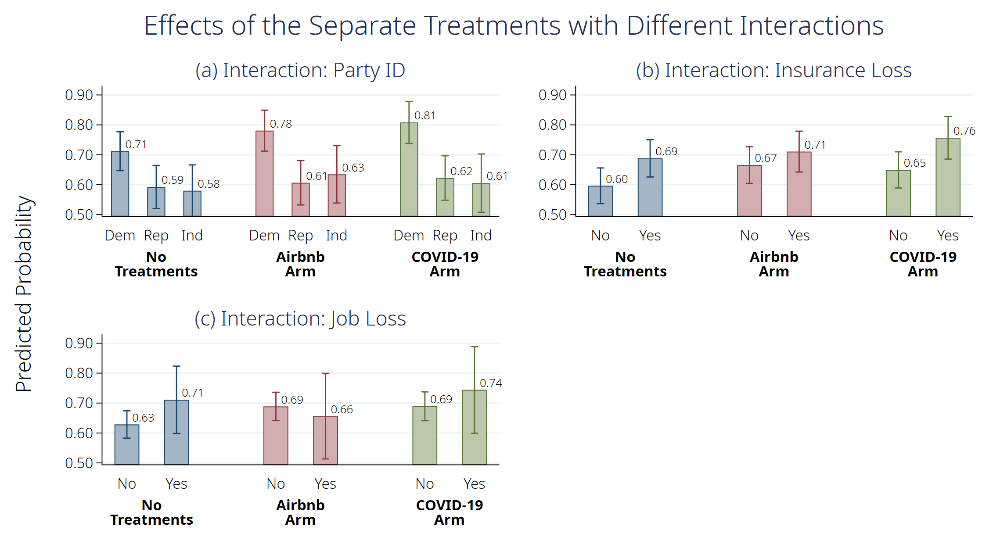
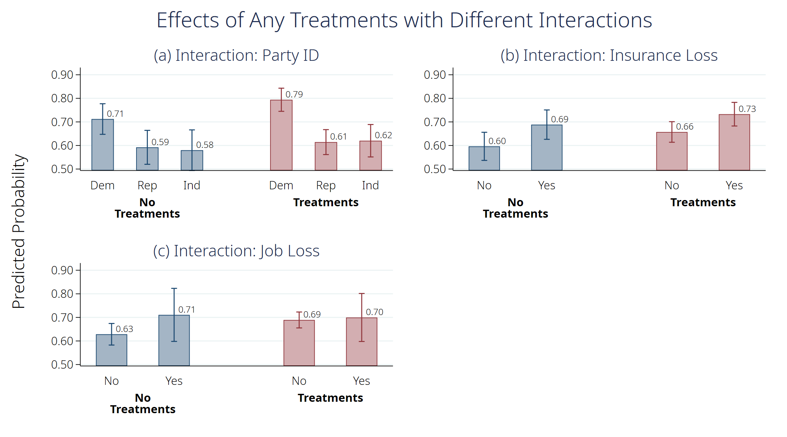
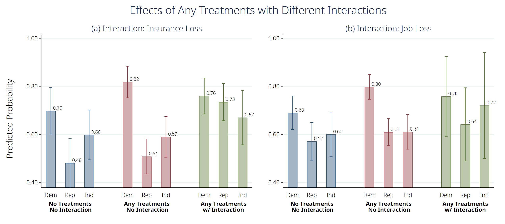

# How is COVID-19 Associated Job-loss affecting Support for Medicare for All?

*Paper Authors: Ashley M Fox, Yongjin Choi, Heather Lanthorn, and Kevin Croke </br> Script Author: Yongjin Choi* </br> *Last updated: Dec. 13. 2020*

* What's Included
    * [Part I. Basic Setting](#part-i-basic-setting)
	* [Part II. Data Prep](#part-ii-data-prep)
	* [Part III. Analysis](#part-iii-Analysis)
      - [Table 1](#table-1)
      - [Table 2](#table-2)
      - [Table 3](#table-3)
      - [Table 4. Ashley's Original Version](#table-4-ashleys-original-version)
      - [Table 4. OLS](#table-4-ols)
      - [Table 5. Ashley's Original Version](#table-5-ashleys-original-version)
      - [Table 5. OLS](#table-5-ols)
      - [Table 5. OLS with Party ID Interactions with Insurance and Job Losses](#table-5-ols-with-party-id-interactions-with-insurance-and-job-losses)

## Part I. Basic Setting

### Delimiter, working directory, and description option


```stata
********************************************************************************
/*----- Basic Setting -----*/
********************************************************************************

/*----- Essentials -----*/
// Initializing, delimiter, and working directory
#delimit cr
clear all
cd "C:\Users\NoMoreTicket\OneDrive - University at Albany - SUNY\05.Research\2019_Framing Single-Payer\06.Submission\JHPPL"
set more off

// Output width
set linesize 240
display "{hline}"

// Color scheme for plots
set scheme s2color
grstyle init
grstyle color background white

// Image Repository
global myimg "C:\Users\NoMoreTicket\OneDrive - University at Albany - SUNY\05.Research\2019_Framing Single-Payer\06.Submission\JHPPL\img"
global esttab_opts nonumbers label nobaselevels interaction(" X ") compress star(* 0.1 ** 0.05 *** 0.01) //addnote("note")
```

    
    delimiter now cr
    
    C:\Users\NoMoreTicket\OneDrive - University at Albany - SUNY\05.Research\2019_Framing Single-Payer\06.Submission\JHPPL
    
    
    
    ------------------------------------------------------------------------------------------------------------------------------------------------------------------------------------------------------------------------------------------------
    
    
    
    
    
    

### (Optional) Packages required


```stata
/*----- (Optional) Installing Packages -----*/
//ssc install estout, replace;
//ssc install catplot, replace;
//ssc install coefplot, replace;
//ssc install tabout, replace;
//ssc install grstyle, replace;
//ssc install palettes, replace;
```

## Part II. Data Prep


```stata
********************************************************************************
/*----- Data Prep -----*/
********************************************************************************

/*----- Simply, loading a cleaned dta from COVID_Survey Data_analysis_Qualtrics_sample_only -----*/
use "COVID_Survey Data_analysis_Qualtrics_sample_only", clear

// Variables
gen treatment = cond(COVID_arm_dummy == 1, 2, cond(Airbnb_arm_dummy == 1, 1, 0))
tab treatment
capture label var treatment "Treatment"
capture label define treatment 0 "Control" 1 "Airbnb Arm" 2 "COVID-19 Arm"
capture label values treatment treatment

capture label var any_treat "Any Treatments"

gen pid_dem = Ideology_1==1 if !missing(Ideology_1)
gen pid_gop = Ideology_1==4 if !missing(Ideology_1)
gen pid_ind = Ideology_1==5 if !missing(Ideology_1)
recode Ideology_1 (1=0 "Dem") (4=1 "Rep") (5 6=2 "Ind"), generate(pid)

// Labeling
label var COVID_arm_dummy "COVID-19 Study Arm (Arm 1)"
label var Airbnb_arm_dummy "Airbnb Study Arm (Arm 2)"
label var female "Female"
label drop lost_insurance_dummy
label var lost_insurance_dummy "Lost Insurance"
capture label define lost_insurance_dummy 0 "Others" 1 "Lost Insurance"
capture label values lost_insurance_dummy lost_insurance_dummy
label drop lost_job
label var lost_job "Lost Job"
label var lost_job "Lost Insurance"
capture label define lost_job 0 "Others" 1 "Lost Job"
capture label values lost_job lost_job
```

    
    
    
    
      treatment |      Freq.     Percent        Cum.
    ------------+-----------------------------------
              0 |        491       35.10       35.10
              1 |        452       32.31       67.41
              2 |        456       32.59      100.00
    ------------+-----------------------------------
          Total |      1,399      100.00
    
    
    
    
    
    (188 missing values generated)
    
    (188 missing values generated)
    
    (188 missing values generated)
    
    (1211 differences between Ideology_1 and pid)
    
    
    
    
    
    
    
    
    
    
    
    
    

## Part III. Analysis

### Table 1


```stata
/*----- Table 1 -----*/
tab support_M4A_likert
```

    
    RECODE of HR_08 |
            (HR_08) |      Freq.     Percent        Cum.
    ----------------+-----------------------------------
     Strongly Favor |        442       36.50       36.50
     Somewhat Favor |        372       30.72       67.22
    Somewhat Oppose |        164       13.54       80.76
    Strongly Oppose |        135       11.15       91.91
         Don't know |         98        8.09      100.00
    ----------------+-----------------------------------
              Total |      1,211      100.00
    

### Table 2


```stata
/*----- Table 2 -----*/
tab HR_11
```

    
          HR_11 |      Freq.     Percent        Cum.
    ------------+-----------------------------------
              1 |        451       37.24       37.24
              4 |        534       44.10       81.34
              5 |        192       15.85       97.19
              6 |         34        2.81      100.00
    ------------+-----------------------------------
          Total |      1,211      100.00
    

### Table 3


```stata
/*----- Table 3 -----*/
sum HR01new_reverse_code, detail
```

    
                   RECODE of HR_01_NEW (HR_01_NEW)
    -------------------------------------------------------------
          Percentiles      Smallest
     1%            1              1
     5%            2              1
    10%            2              1       Obs               1,211
    25%            4              1       Sum of Wgt.       1,211
    
    50%            7                      Mean           6.548307
                            Largest       Std. Dev.      3.127316
    75%           10             10
    90%           10             10       Variance       9.780103
    95%           10             10       Skewness      -.3422122
    99%           10             10       Kurtosis       1.609382
    

### Table 4. Ashley's Original Version


```stata
/*----- Table 4 -----*/
// w/controls and nocontrols columns were switched

eststo clear
eststo m1: qui ologit support_M4A_DK COVID_arm_dummy
eststo m2: qui ologit support_M4A_DK COVID_arm_dummy i.Party_ID female i.age_cat i.race_cat i.income_cat
eststo mfx2: qui margins, at(COVID_arm_dummy=(0/1)) vsquish
qui marginsplot, ytitle("", margin(small)) xtitle("") title("(a) COVID-19 arm (no controls)") name(g2, replace)/*
               */plot(, label("Don't know" "Oppose" "Favor"))/*
               */xsize(8) ysize(5)/*
               */plot1opts(mcolor(gs10) lcolor(gs10) lpattern("--") msymbol(square))/*
               */ci1opts(color(gs10))/*
               */plot2opts(pstyle(p2) msymbol(square))/*
               */plot3opts(pstyle(p1) msymbol(square))/*
               */xlab(-.25 " " 0 "Control" 1 "Treatment" 1.25 " ", notick)

eststo m3: qui ologit support_M4A_DK Airbnb_arm_dummy
eststo m4: qui ologit support_M4A_DK Airbnb_arm_dummy i.Party_ID female i.age_cat i.race_cat i.income_cat
eststo mfx4: qui margins, at(Airbnb_arm_dummy=(0 1)) vsquish
qui marginsplot, ytitle("", margin(small)) xtitle("") title("(b) Airbnb arm (w/ controls)") name(g4, replace)/*
               */plot(, label("Don't know" "Oppose" "Favor"))/*
               */xsize(8) ysize(5)/*
               */plot1opts(mcolor(gs10) lcolor(gs10) lpattern("--") msymbol(square))/*
               */ci1opts(color(gs10))/*
               */plot2opts(pstyle(p2) msymbol(square))/*
               */plot3opts(pstyle(p1) msymbol(square))/*
               */xlab(-.25 " " 0 "Control" 1 "Treatment" 1.25 " ", notick)

qui graph combine g2 g4, l1("Support for M4A (Probability)") ycommon xsize(8) ysize(5)
graph save "$myimg\Table4_original.grh", replace
graph export "$myimg\Table4_original.png", replace


esttab m1 m2 mfx2 m3 m4 mfx4 /*
    //using "C:\Users\NoMoreTicket\OneDrive - University at Albany - SUNY\05.Research\2020_Media Consumption and Social Distancing\02.STATA Outputs\Appendix2.rtf"
    */,replace b(2) ci(3) r2(3) ar2(3) scalar(F) /*
    */order(COVID_arm_dummy Airbnb_arm_dummy) /*
    */title(Table 4. Ordered Logit) /*
    */nonumbers /*
    */mgroups("COVID-19 Arm" "Airbnb Arm", pattern(1 0 0 1 0 0)) /*
    */mtitles("No controls" "w/ controls" "Margins" "No controls" "w/ controls" "Margins") /*
    */addnote("Controls included but not shown (gender, race, income, party ID)") /*
    */label /*
    */nobaselevels /*
    */interaction(" X ") /*
    */varwidth(25) modelwidth(15) compress /*
    */star(* 0.1 ** 0.05 *** 0.01)

//margins COVID_arm_dummy, vsquish
```

    
    
    
    
    
    
    
    
    
    
    
    (note: file C:\Users\NoMoreTicket\OneDrive - University at Albany - SUNY\05.Research\2019_Framing Single-Payer\06.Submission\JHPPL\STATA_Outputs\Table4.grh not found)
    (file C:\Users\NoMoreTicket\OneDrive - University at Albany - SUNY\05.Research\2019_Framing Single-Payer\06.Submission\JHPPL\STATA_Outputs\Table4.grh saved)
    
    (note: file C:\Users\NoMoreTicket\OneDrive - University at Albany - SUNY\05.Research\2019_Framing Single-Payer\06.Submission\JHPPL\STATA_Outputs\Table4.png not found)
    (file C:\Users\NoMoreTicket\OneDrive - University at Albany - SUNY\05.Research\2019_Framing Single-Payer\06.Submission\JHPPL\STATA_Outputs\Table4.png written in PNG format)
    
    
    Table 4. Ordered Logit
    -------------------------------------------------------------------------------------------------------------------------------------------
                                 COVID-19 Arm                                               Airbnb Arm                                         
                                  No controls        w/ controls            Margins        No controls        w/ controls            Margins   
    -------------------------------------------------------------------------------------------------------------------------------------------
    RECODE of support_M4A_l~E                                                                                                                  
    COVID-19 Study Arm (Ar~1)            0.33**             0.40**             0.40**                                                          
                                [0.044,0.621]      [0.088,0.704]      [0.088,0.704]                                                            
    
    Airbnb Study Arm (Arm 2)                                                                      0.24               0.25*              0.25*  
                                                                                        [-0.046,0.522]     [-0.045,0.551]     [-0.045,0.551]   
    
    Republican                                             -0.63***           -0.63***                              -0.66***           -0.66***
                                                 [-0.995,-0.265]    [-0.995,-0.265]                       [-1.018,-0.309]    [-1.018,-0.309]   
    
    Independent                                            -0.76***           -0.76***                              -0.76***           -0.76***
                                                 [-1.164,-0.366]    [-1.164,-0.366]                       [-1.156,-0.371]    [-1.156,-0.371]   
    
    Female                                                 -0.75***           -0.75***                              -0.50***           -0.50***
                                                 [-1.074,-0.423]    [-1.074,-0.423]                       [-0.812,-0.182]    [-0.812,-0.182]   
    
    25-44                                                   0.20               0.20                                  0.15               0.15   
                                                  [-0.247,0.642]     [-0.247,0.642]                        [-0.271,0.580]     [-0.271,0.580]   
    
    45-64                                                  -0.25              -0.25                                  0.07               0.07   
                                                  [-0.759,0.262]     [-0.759,0.262]                        [-0.440,0.577]     [-0.440,0.577]   
    
    65+                                                    -0.55*             -0.55*                                -0.74***           -0.74***
                                                  [-1.122,0.024]     [-1.122,0.024]                       [-1.277,-0.210]    [-1.277,-0.210]   
    
    Hispanic                                                0.09               0.09                                 -0.10              -0.10   
                                                  [-0.574,0.763]     [-0.574,0.763]                        [-0.725,0.529]     [-0.725,0.529]   
    
    black                                                  -0.28              -0.28                                 -0.49**            -0.49** 
                                                  [-0.769,0.216]     [-0.769,0.216]                       [-0.944,-0.030]    [-0.944,-0.030]   
    
    other                                                  -0.24              -0.24                                 -0.37              -0.37   
                                                  [-0.777,0.307]     [-0.777,0.307]                        [-0.890,0.151]     [-0.890,0.151]   
    
    $20,000-$74,999                                        -0.55***           -0.55***                              -0.26              -0.26   
                                                 [-0.952,-0.151]    [-0.952,-0.151]                        [-0.649,0.124]     [-0.649,0.124]   
    
    $75,000-$149,000                                        0.21               0.21                                  0.15               0.15   
                                                  [-0.296,0.715]     [-0.296,0.715]                        [-0.331,0.629]     [-0.331,0.629]   
    
    $150,000+                                               0.52*              0.52*                                 0.57**             0.57** 
                                                  [-0.011,1.053]     [-0.011,1.053]                         [0.051,1.081]      [0.051,1.081]   
    -------------------------------------------------------------------------------------------------------------------------------------------
    /                                                                                                                                          
    cut1                                -2.26***           -3.40***           -3.40***           -2.16***           -3.06***           -3.06***
                              [-2.533,-1.980]    [-4.059,-2.748]    [-4.059,-2.748]    [-2.422,-1.893]    [-3.701,-2.428]    [-3.701,-2.428]   
    
    cut2                                -0.54***           -1.52***           -1.52***           -0.55***           -1.34***           -1.34***
                              [-0.730,-0.342]    [-2.129,-0.914]    [-2.129,-0.914]    [-0.745,-0.358]    [-1.938,-0.740]    [-1.938,-0.740]   
    -------------------------------------------------------------------------------------------------------------------------------------------
    Observations                          820                820                820                829                829                829   
    R-squared                                                                                                                                  
    Adjusted R-squared                                                                                                                         
    F                                                                                                                                          
    -------------------------------------------------------------------------------------------------------------------------------------------
    95% confidence intervals in brackets
    Controls included but not shown (gender, race, income, party ID)
    * p<0.1, ** p<0.05, *** p<0.01
    

### Table 4. OLS




```stata
eststo clear
local interaction pid lost_insurance_dummy lost_job
local title0 "Effects of the Separate Treatments with Different Interactions"
local title1 "(a) Interaction: Party ID"
local title2 "(b) Interaction: Insurance Loss"
local title3 "(c) Interaction: Job Loss"

local coeflabels1 *._at#0.pid = "Dem" *._at#1.pid = "Rep" *._at#2.pid = "Ind"
local coeflabels2 *._at#0.lost_insurance_dummy = "No" *._at#1.lost_insurance_dummy = "Yes"
local coeflabels3 *._at#0.lost_job = "No" *._at#1.lost_job = "Yes"


local num = 1
foreach x in `interaction' {
    
    eststo lm`num': qui reg support_M4A_dummy i.treatment##i.`x' female i.age_cat i.race_cat i.income_cat
    eststo mfx`num': qui margins `x', at(treatment=(0(1)2)) vsquish post
    //tab support_M4A_dummy any_treat, col
    qui coefplot (., keep(1._at#*.`x'))/*
             */(., keep(2._at#*.`x'))/*
             */(., keep(3._at#*.`x'))/*
        */, title("`title`num''") xtitle("") ytitle("")/*
        */vertical legend(rows(1)) recast(bar) barwidth(0.5) fcolor(*.5)/*
        */citop ciopts(recast(rcap)) legend(off) format(%9.2f)/*
        */coeflabels(`coeflabels`num'', notick labgap(2)) plotregion(margin(b=0))/*
        */addplot(scatter @b @at, ms(i) mlabel(@b) mlabpos(2) mlabcolor(black)) ylab(, ang(hor))/*
        */groups(1._at#*.`x' = `""{bf:No}" "{bf:Treatments}""' 2._at#*.`x' = `""{bf:Airbnb}" "{bf:Arm}""' 3._at#*.`x' = `""{bf:COVID-19}" "{bf:Arm}""')/*
        */name(g`num', replace)
    
    local num = `num' + 1
}

qui graph combine g1 g2 g3, /*
    */title("`title0'")/*
    */b1("")/*
    */l1("Predicted Probability")/*
    */ycommon xsize(9) ysize(5)
graph save "$myimg\Table4_OLS.grh", replace
graph export "$myimg\Table4_OLS.png", replace

esttab lm1 mfx1 lm2 mfx2 lm3 mfx3/*
    //using "C:\Users\NoMoreTicket\OneDrive - University at Albany - SUNY\05.Research\2020_Media Consumption and Social Distancing\02.STATA Outputs\Appendix2.rtf"
    */,replace b(4) ci(4) r2(4) ar2(4) scalar(F)/*
    */title(Table 5. OLS Models, Any Treatment with Interactions (Party ID/Job and Insurance Loss))/*
    */mgroups("Party ID" "Insurance Loss" "Job Loss", pattern(1 0 1 0 1 0))/*
    */mtitles("Coefficients" "Margins" "Coefficients" "Margins" "Coefficients" "Margins")/*
    */order(*.treatment *.pid *._at#*.pid *.lost_insurance_dummy *._at#*.lost_insurance_dummy *.lost_job *._at#*.lost_job)/*
    */varwidth(20) modelwidth(15) /*
    */$esttab_opts
```

    
    
    
    
    
    
    
    
    
    
    
    
    
    (file C:\Users\NoMoreTicket\OneDrive - University at Albany - SUNY\05.Research\2019_Framing Single-Payer\06.Submission\JHPPL\img\Table4_OLS.grh saved)
    
    (file C:\Users\NoMoreTicket\OneDrive - University at Albany - SUNY\05.Research\2019_Framing Single-Payer\06.Submission\JHPPL\img\Table4_OLS.png written in PNG format)
    
    
    Table 5. OLS Models, Any Treatment with Interactions (Party ID/Job and Insurance Loss)
    --------------------------------------------------------------------------------------------------------------------------------------
                                Party ID                        Insurance Loss                              Job Loss                      
                            Coefficients            Margins       Coefficients            Margins       Coefficients            Margins   
    --------------------------------------------------------------------------------------------------------------------------------------
    Airbnb Arm                    0.0686                                0.0692                                0.0602*                     
                         [-0.0252,0.1625]                       [-0.0151,0.1535]                       [-0.0057,0.1261]                      
    
    COVID-19 Arm                  0.0960**                              0.0530                                0.0608*                     
                         [0.0005,0.1914]                       [-0.0308,0.1368]                       [-0.0058,0.1274]                      
    
    Rep                          -0.1198**                                                                                                
                         [-0.2173,-0.0222]                                                                                                  
    
    Ind                          -0.1321**                                                                                                
                         [-0.2404,-0.0239]                                                                                                  
    
    Airbnb Arm X Rep             -0.0544                                                                                                  
                         [-0.1939,0.0851]                                                                                                  
    
    Airbnb Arm X Ind             -0.0139                                                                                                  
                         [-0.1723,0.1446]                                                                                                  
    
    COVID-19 Arm X Rep           -0.0657                                                                                                  
                         [-0.2061,0.0746]                                                                                                  
    
    COVID-19 Arm X Ind           -0.0705                                                                                                  
                         [-0.2306,0.0896]                                                                                                  
    
    1._at X Dem                                      0.7120***                                                                            
                                            [0.6470,0.7770]                                                                               
    
    1._at X Rep                                      0.5922***                                                                            
                                            [0.5202,0.6643]                                                                               
    
    1._at X Ind                                      0.5799***                                                                            
                                            [0.4936,0.6661]                                                                               
    
    2._at X Dem                                      0.7806***                                                                            
                                            [0.7122,0.8491]                                                                               
    
    2._at X Rep                                      0.6065***                                                                            
                                            [0.5324,0.6807]                                                                               
    
    2._at X Ind                                      0.6346***                                                                            
                                            [0.5387,0.7306]                                                                               
    
    3._at X Dem                                      0.8080***                                                                            
                                            [0.7379,0.8781]                                                                               
    
    3._at X Rep                                      0.6225***                                                                            
                                            [0.5482,0.6968]                                                                               
    
    3._at X Ind                                      0.6053***                                                                            
                                            [0.5078,0.7028]                                                                               
    
    Lost Insurance                                                      0.0917**                                                          
                                                               [0.0042,0.1792]                                                            
    
    Airbnb Arm X Lost ~e                                               -0.0468                                                            
                                                               [-0.1703,0.0767]                                                            
    
    COVID-19 Arm X Los~e                                                0.0158                                                            
                                                               [-0.1095,0.1410]                                                            
    
    1._at X Others                                                                         0.5965***                                      
                                                                                  [0.5369,0.6560]                                         
    
    1._at X Lost Insur~e                                                                   0.6882***                                      
                                                                                  [0.6258,0.7505]                                         
    
    2._at X Others                                                                         0.6656***                                      
                                                                                  [0.6043,0.7269]                                         
    
    2._at X Lost Insur~e                                                                   0.7106***                                      
                                                                                  [0.6424,0.7788]                                         
    
    3._at X Others                                                                         0.6494***                                      
                                                                                  [0.5890,0.7099]                                         
    
    3._at X Lost Insur~e                                                                   0.7569***                                      
                                                                                  [0.6856,0.8282]                                         
    
    Lost Job                                                                                                  0.0824                      
                                                                                                     [-0.0388,0.2037]                      
    
    Airbnb Arm X Lost ~b                                                                                     -0.1149                      
                                                                                                     [-0.3074,0.0777]                      
    
    COVID-19 Arm X Los~b                                                                                     -0.0276                      
                                                                                                     [-0.2210,0.1658]                      
    
    1._at X Others                                                                                                               0.6285***
                                                                                                                        [0.5827,0.6743]   
    
    1._at X Lost Job                                                                                                             0.7110***
                                                                                                                        [0.5984,0.8235]   
    
    2._at X Others                                                                                                               0.6887***
                                                                                                                        [0.6415,0.7360]   
    
    2._at X Lost Job                                                                                                             0.6563***
                                                                                                                        [0.5134,0.7992]   
    
    3._at X Others                                                                                                               0.6893***
                                                                                                                        [0.6412,0.7374]   
    
    3._at X Lost Job                                                                                                             0.7441***
                                                                                                                        [0.5994,0.8889]   
    
    Female                       -0.1057***                            -0.0844***                            -0.0987***                   
                         [-0.1599,-0.0516]                       [-0.1399,-0.0290]                       [-0.1533,-0.0440]                      
    
    25-44                         0.0462                                0.0615                                0.0640                      
                         [-0.0320,0.1244]                       [-0.0174,0.1404]                       [-0.0158,0.1438]                      
    
    45-64                        -0.0339                                0.0087                               -0.0092                      
                         [-0.1243,0.0565]                       [-0.0843,0.1017]                       [-0.1014,0.0830]                      
    
    65+                          -0.2235***                            -0.1779***                            -0.2000***                   
                         [-0.3279,-0.1192]                       [-0.2858,-0.0701]                       [-0.3067,-0.0933]                      
    
    Hispanic                     -0.0471                               -0.0084                               -0.0099                      
                         [-0.1557,0.0615]                       [-0.1171,0.1004]                       [-0.1191,0.0993]                      
    
    black                        -0.0651                               -0.0264                               -0.0202                      
                         [-0.1466,0.0165]                       [-0.1075,0.0547]                       [-0.1015,0.0611]                      
    
    other                        -0.0433                               -0.0607                               -0.0554                      
                         [-0.1383,0.0517]                       [-0.1561,0.0347]                       [-0.1509,0.0401]                      
    
    $20,000-$74,999              -0.0490                               -0.0458                               -0.0438                      
                         [-0.1188,0.0207]                       [-0.1162,0.0246]                       [-0.1146,0.0269]                      
    
    $75,000-$149,000              0.0248                                0.0335                                0.0423                      
                         [-0.0589,0.1085]                       [-0.0505,0.1175]                       [-0.0420,0.1267]                      
    
    $150,000+                     0.0928**                              0.0975**                              0.1080**                    
                         [0.0093,0.1764]                       [0.0137,0.1814]                       [0.0239,0.1920]                      
    
    Constant                      0.7837***                             0.6251***                             0.6635***                   
                         [0.6710,0.8965]                       [0.5123,0.7379]                       [0.5598,0.7673]                      
    --------------------------------------------------------------------------------------------------------------------------------------
    Observations                    1211               1211               1211               1211               1211               1211   
    R-squared                     0.1159                                0.0954                                0.0903                      
    Adjusted R-squared            0.1026                                0.0840                                0.0789                      
    F                             8.6818                                8.3992                                7.9110                      
    --------------------------------------------------------------------------------------------------------------------------------------
    95% confidence intervals in brackets
    * p<0.1, ** p<0.05, *** p<0.01
    

### Table 5. Ashley's Original Version


```stata
/*----- Table 5 with multinomial logit -----*/
// Typos in the second column
// Plots are not complete

eststo clear
local factors Party_ID lost_job lost_insurance_dummy
local title1 "(a) Party ID No Interaction"
local title2 "(b) Party ID w/ Interaction"
local title3 "(c) Job Loss No Interaction"
local title4 "(d) Job Loss w/ Interaction"
local title5 "(e) Insurance Loss No Interaction"
local title6 "(f) Insurance Loss w/ Interaction"

local num = 1
foreach x in `factors' {
    eststo m`num': qui ologit support_M4A_DK i.any_treat i.`x' female i.age_cat i.race_cat i.income_cat
    local num = `num' + 1
    if "`x'" == "Party_ID" {
        qui margins any_treat, at(`x'=(1 2 3)) vsquish
    }
    else {
        qui margins any_treat, at(`x'=(0 1)) vsquish
    }    
    qui marginsplot, ytitle("", margin(small)) xtitle("") title("`title`num''") name(g2_2, replace)/*
                   */plot(, label("Don't know" "Oppose" "Favor"))/*
                   */xsize(8) ysize(5)/*
                   */plot1opts(mcolor(gs10) lcolor(gs10) lpattern("--") msymbol(square))/*
                   */ci1opts(color(gs10))/*
                   */plot2opts(pstyle(p2) msymbol(square))/*
                   */plot3opts(pstyle(p1) msymbol(square))/*
                   */xlab(-.25 " " 0 "Control" 1 "Lost Insurance" 1.25 " ", notick)

    eststo m`num': qui ologit support_M4A_DK i.any_treat##i.`x' female i.age_cat i.race_cat i.income_cat
    local num = `num' + 1
    if "`x'" == "Party_ID" {
        qui margins any_treat, at(`x'=(1 2 3)) vsquish
    }
    else {
        qui margins any_treat, at(`x'=(0 1)) vsquish
    }
    qui marginsplot, ytitle("", margin(small)) xtitle("") title("`title`num''") name(g2_2, replace)/*
                   */plot(, label("Don't know" "Oppose" "Favor"))/*
                   */xsize(8) ysize(5)/*
                   */plot1opts(mcolor(gs10) lcolor(gs10) lpattern("--") msymbol(square))/*
                   */ci1opts(color(gs10))/*
                   */plot2opts(pstyle(p2) msymbol(square))/*
                   */plot3opts(pstyle(p1) msymbol(square))/*
                   */xlab(-.25 " " 0 "Control" 1 "Lost Insurance" 1.25 " ", notick)
}


esttab /*
    //using "C:\Users\NoMoreTicket\OneDrive - University at Albany - SUNY\05.Research\2020_Media Consumption and Social Distancing\02.STATA Outputs\Appendix2.rtf"
    */,replace b(2) ci(3) r2(3) ar2(3) scalar(F) /*
    */order(any_treat Party_ID) /*
    */title(eTable 1) /*
    */nonumbers /*
    */mgroups("Party ID" "Job Loss" "Insurance Loss", pattern(1 0 1 0 1 0)) /*
    */mtitles("No Interaction" "w/ Interaction" "No Interaction" "w/ Interaction" "No Interaction" "w/ Interaction") /*
    */addnote("Controls included but not shown (gender, race, income, party ID)") /*
    */label /*
    */nobaselevels /*
    */interaction(" X ") /*
    */varwidth(30) modelwidth(27) compress /*
    */star(* 0.1 ** 0.05 *** 0.01)
```

    
    
    
    
    
    
    
    
    
    
    
    
    eTable 1
    ------------------------------------------------------------------------------------------------------------------------------------------------------------------------------------------------------------------------
                                                      Party ID                                                      Job Loss                                                Insurance Loss                                  
                                                No Interaction                 w/ Interaction                 No Interaction                 w/ Interaction                 No Interaction                 w/ Interaction   
    ------------------------------------------------------------------------------------------------------------------------------------------------------------------------------------------------------------------------
    RECODE of support_M4A_likert~E                                                                                                                                                                                          
    any_treat=1                                           0.31**                         0.47**                         0.30**                         0.33**                         0.32**                         0.37** 
                                                 [0.054,0.568]                  [0.036,0.899]                  [0.050,0.560]                  [0.061,0.600]                  [0.068,0.580]                  [0.045,0.702]   
    
    Republican                                           -0.73***                       -0.54**                                                                                                                             
                                               [-1.029,-0.429]                [-1.014,-0.071]                                                                                                                               
    
    Independent                                          -0.82***                       -0.73***                                                                                                                            
                                               [-1.149,-0.487]                [-1.243,-0.212]                                                                                                                               
    
    Female                                               -0.62***                       -0.62***                       -0.58***                       -0.58***                       -0.50***                       -0.50***
                                               [-0.884,-0.351]                [-0.889,-0.355]                [-0.840,-0.315]                [-0.840,-0.315]                [-0.765,-0.233]                [-0.765,-0.233]   
    
    25-44                                                 0.15                           0.15                           0.22                           0.22                           0.24                           0.25   
                                                [-0.226,0.523]                 [-0.222,0.528]                 [-0.155,0.590]                 [-0.152,0.593]                 [-0.129,0.615]                 [-0.124,0.621]   
    
    45-64                                                -0.15                          -0.15                          -0.08                          -0.07                           0.08                           0.09   
                                                [-0.573,0.283]                 [-0.577,0.280]                 [-0.504,0.350]                 [-0.501,0.354]                 [-0.353,0.519]                 [-0.350,0.522]   
    
    65+                                                  -0.78***                       -0.77***                       -0.67***                       -0.67***                       -0.48**                        -0.48** 
                                               [-1.245,-0.313]                [-1.235,-0.300]                [-1.139,-0.203]                [-1.139,-0.203]                [-0.955,-0.002]                [-0.956,-0.003]   
    
    Hispanic                                             -0.27                          -0.26                          -0.07                          -0.08                          -0.09                          -0.09   
                                                [-0.795,0.260]                 [-0.793,0.263]                 [-0.590,0.447]                 [-0.598,0.441]                 [-0.608,0.430]                 [-0.610,0.427]   
    
    black                                                -0.38*                         -0.38*                         -0.16                          -0.16                          -0.20                          -0.20   
                                                [-0.783,0.019]                 [-0.785,0.017]                 [-0.550,0.227]                 [-0.546,0.231]                 [-0.592,0.188]                 [-0.590,0.191]   
    
    other                                                -0.23                          -0.25                          -0.31                          -0.31                          -0.37                          -0.37   
                                                [-0.682,0.217]                 [-0.698,0.203]                 [-0.755,0.130]                 [-0.753,0.132]                 [-0.812,0.078]                 [-0.812,0.078]   
    
    $20,000-$74,999                                      -0.23                          -0.23                          -0.21                          -0.20                          -0.21                          -0.21   
                                                [-0.556,0.099]                 [-0.561,0.095]                 [-0.532,0.115]                 [-0.527,0.121]                 [-0.534,0.115]                 [-0.532,0.117]   
    
    $75,000-$149,000                                      0.22                           0.22                           0.30                           0.31                           0.28                           0.29   
                                                [-0.195,0.626]                 [-0.188,0.633]                 [-0.100,0.709]                 [-0.098,0.711]                 [-0.123,0.684]                 [-0.119,0.689]   
    
    $150,000+                                             0.60***                        0.60***                        0.67***                        0.67***                        0.61***                        0.61***
                                                 [0.166,1.039]                  [0.166,1.039]                  [0.235,1.097]                  [0.237,1.100]                  [0.180,1.043]                  [0.179,1.043]   
    
    any_treat=1 X Republican                                                            -0.31                                                                                                                               
                                                                               [-0.903,0.292]                                                                                                                               
    
    any_treat=1 X Independent                                                           -0.15                                                                                                                               
                                                                               [-0.805,0.509]                                                                                                                               
    
    lost_job=1                                                                                                          0.22                           0.34                                                                 
                                                                                                              [-0.189,0.620]                 [-0.262,0.944]                                                                 
    
    any_treat=1 X lost_job=1                                                                                                                          -0.23                                                                 
                                                                                                                                             [-1.023,0.568]                                                                 
    
    you personally or someone cl~                                                                                                                                                     0.53***                        0.61***
                                                                                                                                                                             [0.252,0.814]                  [0.190,1.024]   
    
    any_treat=1 X you personally~                                                                                                                                                                                   -0.13   
                                                                                                                                                                                                           [-0.647,0.396]   
    ------------------------------------------------------------------------------------------------------------------------------------------------------------------------------------------------------------------------
    /                                                                                                                                                                                                                       
    cut1                                                 -3.28***                       -3.19***                       -2.59***                       -2.57***                       -2.30***                       -2.27***
                                               [-3.841,-2.718]                [-3.782,-2.597]                [-3.106,-2.080]                [-3.090,-2.054]                [-2.837,-1.770]                [-2.821,-1.713]   
    
    cut2                                                 -1.42***                       -1.33***                       -0.78***                       -0.75***                       -0.47*                         -0.44   
                                               [-1.951,-0.899]                [-1.893,-0.775]                [-1.258,-0.293]                [-1.242,-0.265]                 [-0.980,0.034]                 [-0.965,0.094]   
    ------------------------------------------------------------------------------------------------------------------------------------------------------------------------------------------------------------------------
    _                                                                                                                                                                                                                       
    any_treat                                                                                                                                                                                                               
                                                                                                                                                                                                                            
    
    RECODE of Ideology_1 (Ideolo~1                                                                                                                                                                                          
                                                                                                                                                                                                                            
    ------------------------------------------------------------------------------------------------------------------------------------------------------------------------------------------------------------------------
    Observations                                          1211                           1211                           1211                           1211                           1211                           1211   
    R-squared                                                                                                                                                                                                               
    Adjusted R-squared                                                                                                                                                                                                      
    F                                                                                                                                                                                                                       
    ------------------------------------------------------------------------------------------------------------------------------------------------------------------------------------------------------------------------
    95% confidence intervals in brackets
    Controls included but not shown (gender, race, income, party ID)
    * p<0.1, ** p<0.05, *** p<0.01
    

### Table 5. OLS




```stata
eststo clear
local interaction pid lost_insurance_dummy lost_job
local title0 "Effects of Any Treatments with Different Interactions"
local title1 "(a) Interaction: Party ID"
local title2 "(b) Interaction: Insurance Loss"
local title3 "(c) Interaction: Job Loss"

local coeflabels1 *._at#0.pid = "Dem" *._at#1.pid = "Rep" *._at#2.pid = "Ind"
local coeflabels2 *._at#0.lost_insurance_dummy = "No" *._at#1.lost_insurance_dummy = "Yes"
local coeflabels3 *._at#0.lost_job = "No" *._at#1.lost_job = "Yes"


local num = 1
foreach x in `interaction' {
    
    eststo lm`num': qui reg support_M4A_dummy i.any_treat##i.`x' female i.age_cat i.race_cat i.income_cat
    eststo mfx`num': qui margins `x', at(any_treat=(0 1)) vsquish post
    //tab support_M4A_dummy any_treat, col
    qui coefplot (., keep(1._at#*.`x'))/*
             */(., keep(2._at#*.`x'))/*
        */, title("`title`num''") xtitle("") ytitle("")/*
        */vertical legend(rows(1)) recast(bar) barwidth(0.5) fcolor(*.5)/*
        */citop ciopts(recast(rcap)) legend(off) format(%9.2f)/*
        */coeflabels(`coeflabels`num'', notick labgap(2)) plotregion(margin(b=0))/*
        */addplot(scatter @b @at, ms(i) mlabel(@b) mlabpos(2) mlabcolor(black)) ylab(, ang(hor))/*
        */groups(1._at#*.`x' = `""{bf:No}" "{bf:Treatments}""' 2._at#*.`x' = `"{bf:Treatments}"')/*
        */name(g`num', replace)
    
    local num = `num' + 1
}

qui graph combine g1 g2 g3, /*
    */title("`title0'")/*
    */b1("")/*
    */l1("Predicted Probability")/*
    */ycommon xsize(9) ysize(5)
graph save "$myimg\Table5_OLS.gph", replace
graph export "$myimg\Table5_OLS.png", replace

esttab lm1 mfx1 lm2 mfx2 lm3 mfx3/*
    //using "C:\Users\NoMoreTicket\OneDrive - University at Albany - SUNY\05.Research\2020_Media Consumption and Social Distancing\02.STATA Outputs\Appendix2.rtf"
    */,replace b(4) ci(4) r2(4) ar2(4) scalar(F)/*
    */title(Table 5. OLS Models, Any Treatment with Interactions (Party ID/Job and Insurance Loss))/*
    */mgroups("Party ID" "Insurance Loss" "Job Loss", pattern(1 0 1 0 1 0))/*
    */mtitles("Coefficients" "Margins" "Coefficients" "Margins" "Coefficients" "Margins")/*
    */order(*.any_treat *.pid *._at#*.pid *.lost_insurance_dummy *._at#*.lost_insurance_dummy *.lost_job *._at#*.lost_job)/*
    */varwidth(20) modelwidth(15) /*
    */$esttab_opts
```

    
    
    
    
    
    
    
    
    
    
    
    
    
    (file C:\Users\NoMoreTicket\OneDrive - University at Albany - SUNY\05.Research\2019_Framing Single-Payer\06.Submission\JHPPL\img\Table5_OLS.gph saved)
    
    (file C:\Users\NoMoreTicket\OneDrive - University at Albany - SUNY\05.Research\2019_Framing Single-Payer\06.Submission\JHPPL\img\Table5_OLS.png written in PNG format)
    
    
    Table 5. OLS Models, Any Treatment with Interactions (Party ID/Job and Insurance Loss)
    --------------------------------------------------------------------------------------------------------------------------------------
                                Party ID                        Insurance Loss                              Job Loss                      
                            Coefficients            Margins       Coefficients            Margins       Coefficients            Margins   
    --------------------------------------------------------------------------------------------------------------------------------------
    Any Treatments=1              0.0818**                              0.0610*                               0.0606**                    
                         [0.0008,0.1628]                       [-0.0116,0.1336]                       [0.0036,0.1177]                      
    
    Rep                          -0.1200**                                                                                                
                         [-0.2174,-0.0225]                                                                                                  
    
    Ind                          -0.1322**                                                                                                
                         [-0.2403,-0.0240]                                                                                                  
    
    Any Treatments=1 X~p         -0.0596                                                                                                  
                         [-0.1799,0.0606]                                                                                                  
    
    Any Treatments=1 X~d         -0.0416                                                                                                  
                         [-0.1770,0.0938]                                                                                                  
    
    1._at X Dem                                      0.7122***                                                                            
                                            [0.6472,0.7771]                                                                               
    
    1._at X Rep                                      0.5922***                                                                            
                                            [0.5202,0.6642]                                                                               
    
    1._at X Ind                                      0.5800***                                                                            
                                            [0.4938,0.6662]                                                                               
    
    2._at X Dem                                      0.7940***                                                                            
                                            [0.7449,0.8431]                                                                               
    
    2._at X Rep                                      0.6144***                                                                            
                                            [0.5614,0.6673]                                                                               
    
    2._at X Ind                                      0.6202***                                                                            
                                            [0.5514,0.6890]                                                                               
    
    Lost Insurance                                                      0.0921**                                                          
                                                               [0.0046,0.1796]                                                            
    
    Any Treatments=1 X~c                                               -0.0167                                                            
                                                               [-0.1230,0.0896]                                                            
    
    1._at X Others                                                                         0.5963***                                      
                                                                                  [0.5368,0.6559]                                         
    
    1._at X Lost Insur~e                                                                   0.6884***                                      
                                                                                  [0.6261,0.7507]                                         
    
    2._at X Others                                                                         0.6573***                                      
                                                                                  [0.6136,0.7010]                                         
    
    2._at X Lost Insur~e                                                                   0.7327***                                      
                                                                                  [0.6826,0.7828]                                         
    
    Lost Job                                                                                                  0.0822                      
                                                                                                     [-0.0390,0.2033]                      
    
    Any Treatments=1 X~b                                                                                     -0.0716                      
                                                                                                     [-0.2321,0.0889]                      
    
    1._at X Others                                                                                                               0.6285***
                                                                                                                        [0.5827,0.6742]   
    
    1._at X Lost Job                                                                                                             0.7106***
                                                                                                                        [0.5981,0.8231]   
    
    2._at X Others                                                                                                               0.6891***
                                                                                                                        [0.6553,0.7228]   
    
    2._at X Lost Job                                                                                                             0.6997***
                                                                                                                        [0.5979,0.8014]   
    
    Female                       -0.1056***                            -0.0839***                            -0.0989***                   
                         [-0.1596,-0.0515]                       [-0.1393,-0.0285]                       [-0.1535,-0.0443]                      
    
    25-44                         0.0458                                0.0627                                0.0603                      
                         [-0.0323,0.1239]                       [-0.0162,0.1415]                       [-0.0189,0.1395]                      
    
    45-64                        -0.0331                                0.0096                               -0.0114                      
                         [-0.1233,0.0571]                       [-0.0833,0.1025]                       [-0.1033,0.0805]                      
    
    65+                          -0.2232***                            -0.1761***                            -0.2030***                   
                         [-0.3273,-0.1190]                       [-0.2838,-0.0684]                       [-0.3094,-0.0966]                      
    
    Hispanic                     -0.0481                               -0.0100                               -0.0109                      
                         [-0.1565,0.0604]                       [-0.1186,0.0987]                       [-0.1200,0.0981]                      
    
    black                        -0.0656                               -0.0253                               -0.0214                      
                         [-0.1470,0.0159]                       [-0.1063,0.0557]                       [-0.1026,0.0599]                      
    
    other                        -0.0432                               -0.0628                               -0.0563                      
                         [-0.1380,0.0517]                       [-0.1581,0.0324]                       [-0.1517,0.0391]                      
    
    $20,000-$74,999              -0.0492                               -0.0461                               -0.0441                      
                         [-0.1188,0.0205]                       [-0.1164,0.0243]                       [-0.1147,0.0265]                      
    
    $75,000-$149,000              0.0249                                0.0351                                0.0435                      
                         [-0.0586,0.1085]                       [-0.0488,0.1190]                       [-0.0408,0.1277]                      
    
    $150,000+                     0.0943**                              0.0974**                              0.1089**                    
                         [0.0109,0.1777]                       [0.0136,0.1812]                       [0.0249,0.1928]                      
    
    Constant                      0.7836***                             0.6236***                             0.6663***                   
                         [0.6710,0.8962]                       [0.5109,0.7363]                       [0.5629,0.7697]                      
    --------------------------------------------------------------------------------------------------------------------------------------
    Observations                    1211               1211               1211               1211               1211               1211   
    R-squared                     0.1155                                0.0946                                0.0898                      
    Adjusted R-squared            0.1044                                0.0848                                0.0799                      
    F                            10.4011                                9.6209                                9.0824                      
    --------------------------------------------------------------------------------------------------------------------------------------
    95% confidence intervals in brackets
    * p<0.1, ** p<0.05, *** p<0.01
    

### Table 5. OLS with Party ID Interactions with Insurance and Job Losses




```stata
eststo clear
local interaction lost_insurance_dummy lost_job
local title0 "Effects of Any Treatments with Different Interactions"
local title1 "(a) Interaction: Insurance Loss"
local title2 "(b) Interaction: Job Loss"

local coeflabels1 *._at#0.pid#*.lost_insurance_dummy = "Dem" *._at#1.pid#*.lost_insurance_dummy = "Rep" *._at#2.pid#*.lost_insurance_dummy = "Ind"
local coeflabels2 *._at#0.pid#*.lost_job = "Dem" *._at#1.pid#*.lost_job = "Rep" *._at#2.pid#*.lost_job = "Ind"


local num = 1
foreach x in `interaction' {
    
    eststo lm`num': qui reg support_M4A_dummy i.any_treat##i.pid##i.`x' female i.age_cat i.race_cat i.income_cat
    eststo mfx`num': qui margins pid##`x', at(any_treat=(0 1)) vsquish post
    //tab support_M4A_dummy any_treat, col
    qui coefplot (., keep(1._at#*.pid#0.`x'))/*
               */(., keep(2._at#*.pid#0.`x'))/*
               */(., keep(2._at#*.pid#1.`x'))/*
        */, title("`title`num''") xtitle("") ytitle("")/*
        */vertical legend(rows(1)) recast(bar) barwidth(0.5) fcolor(*.5)/*
        */citop ciopts(recast(rcap)) legend(off) format(%9.2f)/*
        */coeflabels(`coeflabels`num'', notick labgap(2)) plotregion(margin(b=0))/*
        */addplot(scatter @b @at, ms(i) mlabel(@b) mlabpos(2) mlabcolor(black)) ylab(, ang(hor))/*
        */groups(1._at#*.pid#*.`x' = `""{bf:No Treatments}" "{bf: No Interaction}""' 2._at#*.pid#0.`x' = `""{bf:Any Treatments}" "{bf: No Interaction}""' 2._at#*.pid#1.`x' = `""{bf:Any Treatments}" "{bf:w/ Interaction}""')/*
        */name(g`num', replace)
    
    local num = `num' + 1
}

qui graph combine g1 g2, /*
    */title("`title0'")/*
    */b1("")/*
    */l1("Predicted Probability")/*
    */ycommon xsize(9) ysize(4)
graph save "$myimg\Table5_OLS_pidInteraction.gph", replace
graph export "$myimg\Table5_OLS_pidInteraction.png", replace

esttab lm1 mfx1 lm2 mfx2/*
    //using "C:\Users\NoMoreTicket\OneDrive - University at Albany - SUNY\05.Research\2020_Media Consumption and Social Distancing\02.STATA Outputs\Appendix2.rtf"
    */,replace b(4) ci(4) r2(4) ar2(4) scalar(F)/*
    */title(Table 5. OLS Models, Any Treatment with Party ID Interactions (Job and Insurance Loss))/*
    */mgroups("Insurance Loss" "Job Loss", pattern(1 0 1 0))/*
    */mtitles("Coefficients" "Margins" "Coefficients" "Margins")/*
    */order("---|Individual Coefs|--" 1.any_treat 1.pid 2.pid 1.lost_insurance_dummy 1.lost_job /*
    */"---|Interaction Coefs|--" *.any_treat#*.pid *.any_treat#1.lost_insurance_dummy *.any_treat#1.lost_job 1.pid#1.lost_insurance_dummy 1.pid#1.lost_job 2.pid#1.lost_insurance_dummy 2.pid#1.lost_job /*
    */1.any_treat#*.pid#1.lost_insurance_dummy 1.any_treat#*.pid#1.lost_job /*
    */"---|Margins at Treat=0|--" 1._at#*.pid 1._at#*.lost_insurance_dummy 1._at#*.lost_job 1._at#*.pid#*.lost_insurance_dummy /*
    
    */"---|Margins at Treat=1|--" 2._at 2._at#*.pid 2._at#*.lost_insurance_dummy 2._at#*.lost_job 2._at#*.pid#*.lost_insurance_dummy)/*
    */varwidth(25) modelwidth(15)/*
    */wide $esttab_opts
```

    
    
    
    
    
    
    
    
    
    
    
    (file C:\Users\NoMoreTicket\OneDrive - University at Albany - SUNY\05.Research\2019_Framing Single-Payer\06.Submission\JHPPL\img\Table5_OLS_pidInteraction.gph saved)
    
    (file C:\Users\NoMoreTicket\OneDrive - University at Albany - SUNY\05.Research\2019_Framing Single-Payer\06.Submission\JHPPL\img\Table5_OLS_pidInteraction.png written in PNG format)
    
    
    Table 5. OLS Models, Any Treatment with Party ID Interactions (Job and Insurance Loss)
    ---------------------------------------------------------------------------------------------------------------------------------------------------------------------
                               Insurance Loss                                                              Job Loss                                                      
                                 Coefficients                            Margins                       Coefficients                            Margins                   
    ---------------------------------------------------------------------------------------------------------------------------------------------------------------------
    ---|Individual Coefs|--                                                                                                                                              
    Any Treatments=1                   0.1199**  [0.0044,0.2353]                                             0.1078**  [0.0215,0.1940]                                   
    Rep                               -0.2178*** [-0.3579,-0.0778]                                            -0.1188**  [-0.2242,-0.0134]                                   
    Ind                               -0.1004    [-0.2416,0.0408]                                            -0.0898    [-0.2061,0.0266]                                   
    Lost Insurance                     0.0287    [-0.1014,0.1588]                                                                                                         
    Lost Job                                                                                                 0.1671*   [-0.0180,0.3523]                                   
    ---|Interaction Coefs|--                                                                                                                                             
    Any Treatments=1 X Rep            -0.0923    [-0.2615,0.0768]                                            -0.0693    [-0.1983,0.0598]                                   
    Any Treatments=1 X Ind            -0.1280    [-0.3035,0.0475]                                            -0.0973    [-0.2419,0.0473]                                   
    Any Treatments=1 X Lost~c         -0.0867    [-0.2480,0.0746]                                                                                                         
    Any Treatments=1 X Lost~b                                                                               -0.2064    [-0.4597,0.0469]                                   
    Rep X Lost Insurance               0.1948**  [0.0029,0.3866]                                                                                                         
    Rep X Lost Job                                                                                          -0.0307    [-0.3020,0.2406]                                   
    Ind X Lost Insurance              -0.0857    [-0.3070,0.1357]                                                                                                         
    Ind X Lost Job                                                                                          -0.2988*   [-0.6052,0.0076]                                   
    Any Treatments=1 X Rep ~n          0.0898    [-0.1491,0.3288]                                                                                                         
    Any Treatments=1 X Ind ~n          0.2240    [-0.0556,0.5036]                                                                                                         
    Any Treatments=1 X Rep ~o                                                                                0.1024    [-0.2585,0.4632]                                   
    Any Treatments=1 X Ind ~o                                                                                0.4480**  [0.0288,0.8672]                                   
    ---|Margins at Treat=0|--                                                                                                                                            
    1._at X Dem                                                           0.7111*** [0.6454,0.7768]                                             0.7091*** [0.6441,0.7741]
    1._at X Rep                                                           0.5811*** [0.5093,0.6528]                                             0.5867*** [0.5143,0.6591]
    1._at X Ind                                                           0.5721*** [0.4837,0.6605]                                             0.5845*** [0.4981,0.6708]
    1._at X Others                                                        0.5978*** [0.5383,0.6573]                                                                      
    1._at X Lost Insurance                                                0.6769*** [0.6149,0.7390]                                                                      
    1._at X Dem X Others                                                  0.6982*** [0.6016,0.7947]                                                                      
    1._at X Dem X Lost Insu~e                                             0.7268*** [0.6402,0.8135]                                                                      
    1._at X Rep X Others                                                  0.4803*** [0.3784,0.5823]                                                                      
    1._at X Rep X Lost Insu~e                                             0.7038*** [0.6024,0.8051]                                                                      
    1._at X Ind X Others                                                  0.5978*** [0.4941,0.7014]                                                                      
    1._at X Ind X Lost Insu~e                                             0.5408*** [0.3914,0.6902]                                                                      
    1._at X Others                                                                                                                              0.6270*** [0.5818,0.6722]
    1._at X Lost Job                                                                                                                            0.7163*** [0.6053,0.8274]
    1._at X Dem X Others                                                                                                                        0.6896*** [0.6199,0.7593]
    1._at X Dem X Lost Job                                                                                                                      0.8567*** [0.6843,1.0291]
    1._at X Rep X Others                                                                                                                        0.5708*** [0.4925,0.6492]
    1._at X Rep X Lost Job                                                                                                                      0.7073*** [0.5239,0.8906]
    1._at X Ind X Others                                                                                                                        0.5998*** [0.5071,0.6925]
    1._at X Ind X Lost Job                                                                                                                      0.4681*** [0.2405,0.6957]
    ---|Margins at Treat=1|--                                                                                                                                            
    2._at                                                                                                                                                                
    2._at X Dem                                                           0.7918*** [0.7432,0.8405]                                             0.7928*** [0.7435,0.8421]
    2._at X Rep                                                           0.6100*** [0.5575,0.6625]                                             0.6131*** [0.5601,0.6660]
    2._at X Ind                                                           0.6258*** [0.5565,0.6952]                                             0.6231*** [0.5542,0.6921]
    2._at X Others                                                        0.6560*** [0.6131,0.6989]                                                                      
    2._at X Lost Insurance                                                0.7307*** [0.6813,0.7801]                                                                      
    2._at X Dem X Others                                                  0.8180*** [0.7524,0.8836]                                                                      
    2._at X Dem X Lost Insu~e                                             0.7600*** [0.6854,0.8345]                                                                      
    2._at X Rep X Others                                                  0.5078*** [0.4352,0.5805]                                                                      
    2._at X Rep X Lost Insu~e                                             0.7344*** [0.6571,0.8118]                                                                      
    2._at X Ind X Others                                                  0.5896*** [0.5049,0.6744]                                                                      
    2._at X Ind X Lost Insu~e                                             0.6699*** [0.5565,0.7834]                                                                      
    2._at X Others                                                                                                                              0.6883*** [0.6550,0.7216]
    2._at X Lost Job                                                                                                                            0.7080*** [0.6064,0.8096]
    2._at X Dem X Others                                                                                                                        0.7974*** [0.7460,0.8488]
    2._at X Dem X Lost Job                                                                                                                      0.7581*** [0.5921,0.9242]
    2._at X Rep X Others                                                                                                                        0.6093*** [0.5529,0.6657]
    2._at X Rep X Lost Job                                                                                                                      0.6417*** [0.4892,0.7942]
    2._at X Ind X Others                                                                                                                        0.6103*** [0.5383,0.6824]
    2._at X Ind X Lost Job                                                                                                                      0.7202*** [0.4996,0.9409]
    Female                            -0.0908*** [-0.1454,-0.0361]                                            -0.1065*** [-0.1606,-0.0524]                                   
    25-44                              0.0510    [-0.0267,0.1287]                                             0.0484    [-0.0303,0.1272]                                   
    45-64                             -0.0034    [-0.0948,0.0880]                                            -0.0278    [-0.1188,0.0633]                                   
    65+                               -0.1815*** [-0.2880,-0.0750]                                            -0.2149*** [-0.3205,-0.1093]                                   
    Hispanic                          -0.0455    [-0.1529,0.0620]                                            -0.0513    [-0.1600,0.0573]                                   
    black                             -0.0703*   [-0.1511,0.0105]                                            -0.0687*   [-0.1503,0.0129]                                   
    other                             -0.0498    [-0.1442,0.0447]                                            -0.0419    [-0.1371,0.0534]                                   
    $20,000-$74,999                   -0.0447    [-0.1138,0.0244]                                            -0.0453    [-0.1151,0.0245]                                   
    $75,000-$149,000                   0.0289    [-0.0540,0.1119]                                             0.0295    [-0.0543,0.1134]                                   
    $150,000+                          0.0874**  [0.0046,0.1702]                                             0.1006**  [0.0169,0.1842]                                   
    Constant                           0.7484*** [0.6111,0.8856]                                             0.7549*** [0.6381,0.8717]                                   
    ---------------------------------------------------------------------------------------------------------------------------------------------------------------------
    Observations                         1211                               1211                               1211                               1211                   
    R-squared                          0.1367                                                                0.1209                                                      
    Adjusted R-squared                 0.1215                                                                0.1053                                                      
    F                                  8.9690                                                                7.7841                                                      
    ---------------------------------------------------------------------------------------------------------------------------------------------------------------------
    95% confidence intervals in brackets
    * p<0.1, ** p<0.05, *** p<0.01
    
