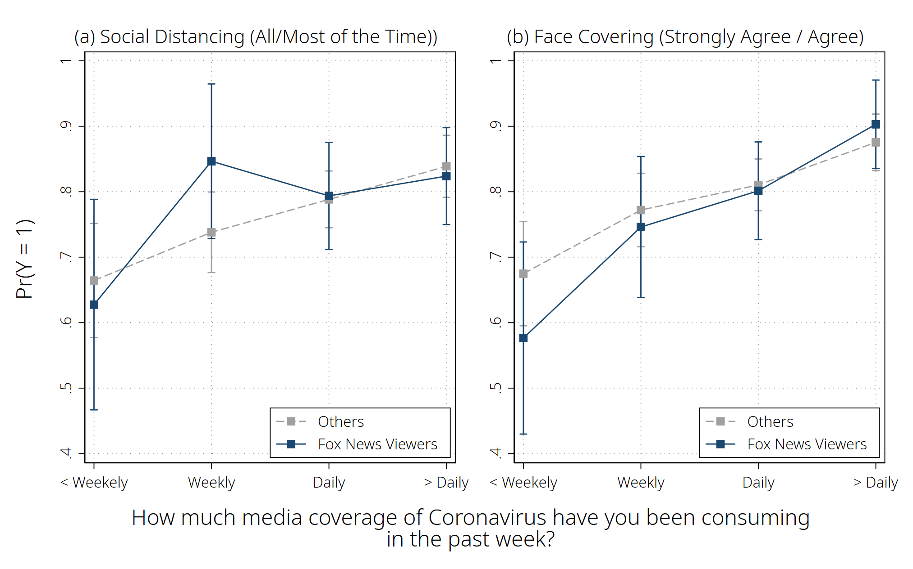
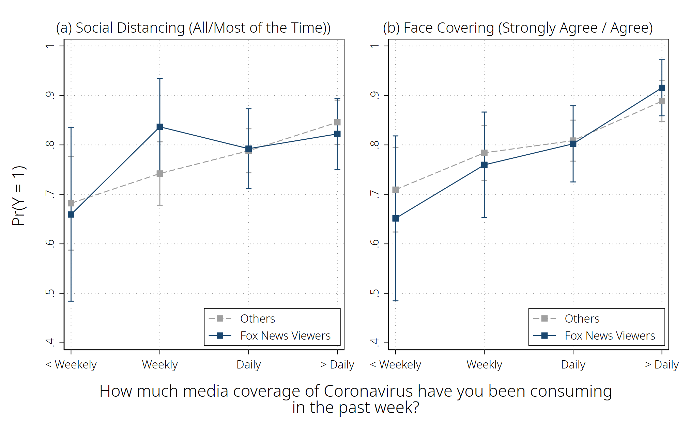
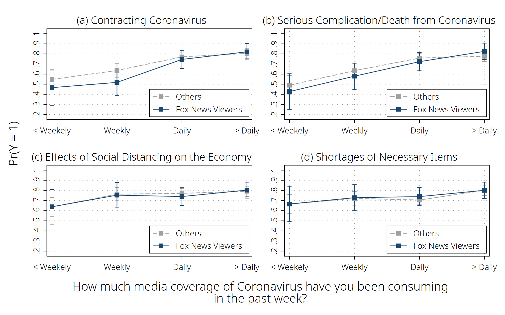
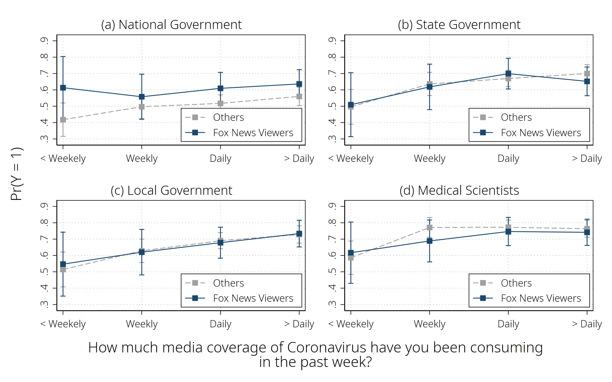
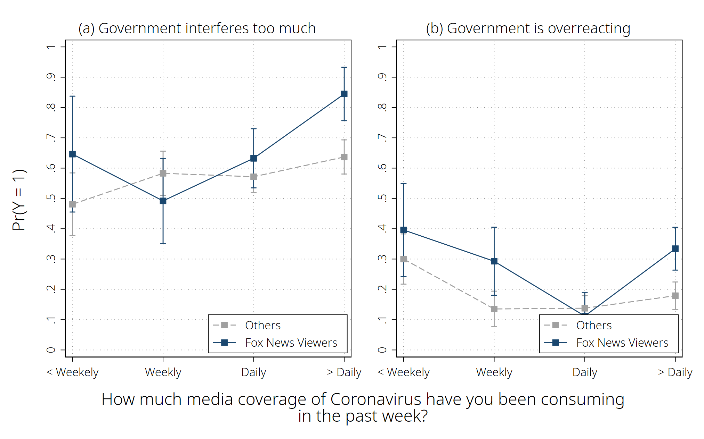
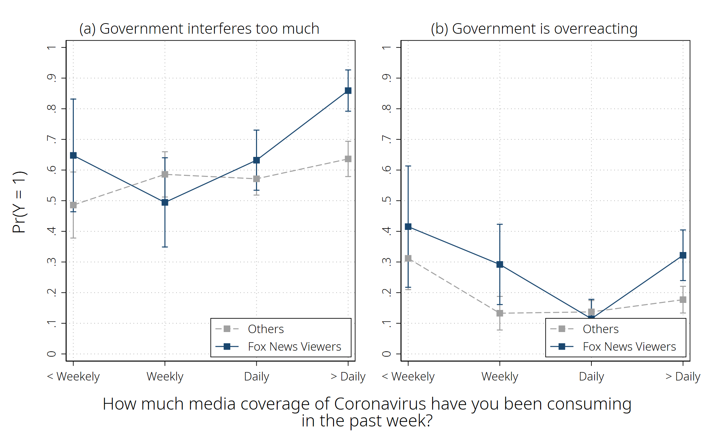
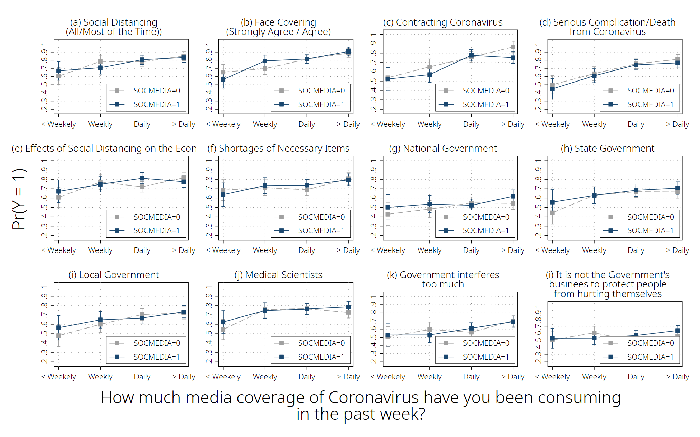

# Does media slant polarize compliance with science-based public health recommendations? Effects of media consumption patterns on COVID-19 attitudes and behaviors in the United States

* Paper Authors: Yongjin Choi and Ashley M. Fox </br>
* Citation: Choi, Yongjin and A. M. Fox. Does media slant polarize compliance with science-based public health recommendations? Effects of media consumption patterns on COVID-19 attitudes and behaviors in the United States. _forthcoming in Journal of Health Psychology_. </br>
* Last updated: Dec. 9. 2020*

* What's Included
	- [Part I. Basic Setting](#part-i-basic-setting)
	- [Part II. Data Prep](#part-ii-data-prep)
	- [Part III. Analysis](#part-iii-Analysis)

## Part I. Basic Setting


```stata
********************************************************************************
/*----- Basic Setting -----*/
********************************************************************************

/*----- Essentials -----*/
#delimit ;
clear all;
cd "C:\Users\NoMoreTicket\OneDrive - University at Albany - SUNY\03.data\01.Survey\202006_COVID19";
set more off;

// Output width
set linesize 240;
display "{hline}";

// Color scheme for plots
grstyle clear;
set scheme s2color;
grstyle init;
grstyle set plain, box;
grstyle color background white;
//grstyle set color Set1;
grstyle yesno draw_major_hgrid yes;
grstyle yesno draw_major_ygrid yes;
grstyle color major_grid gs8;
grstyle linepattern major_grid dot;
grstyle set legend 4, box inside;
grstyle color ci_area gs12%50;

// Esttab Options
global esttab_opts nonumbers label nobaselevels interaction(" X ") compress star(* 0.1 ** 0.05 *** 0.01); //addnote("note")
```

    
    
    C:\Users\NoMoreTicket\OneDrive - University at Albany - SUNY\03.data\01.Survey\2
    > 02006_COVID19
    
    
    
    ------------------------------------------------------------------------------------------------------------------------------------------------------------------------------------------------------------------------------------------------
    
    
    
    
    
    
    
    
    
    
    
    
    delimiter now ;

### (Optional) Packages required


```stata
/*----- Installing Packages -----*/
//ssc install estout, replace;
//ssc install catplot, replace;
//ssc install coefplot, replace;
//ssc install tabout, replace;
//ssc install grstyle, replace;
//ssc install palettes, replace;
```

# Part II. Data Prep


```stata
********************************************************************************
/*----- Data Prep -----*/
********************************************************************************

/*----- Importing csv -----*/
clear all;
import delimited "C:\Users\NoMoreTicket\OneDrive - University at Albany - SUNY\03.data\01.Survey\202006_COVID19\COVID19Survey_20200613text_Ver1.0.csv", case(upper) clear;

drop if DURATION < 420;


/*----- Variables -----*/
// Treatment
capture label var TREATMENT "Treatment";
capture label define TREATMENT 0 "Control" 1 "Normal Unemployment" 2 "COVID19 Unemployment";
capture label values TREATMENT TREATMENT;

// MEDIA_FREQ: How much media coverage of Coronavirus have you been consuming in the past week?
gen MEDIA_FREQ = cond(MEDIA1 == "Very Little (less than weekly)", 0,
                         cond(MEDIA1 == "Somewhat (weekly)", 1,
                         cond(MEDIA1 == "A lot (daily)", 2, 3)));
capture label var MEDIA_FREQ "Media Consumption";
capture label define MEDIA_FREQ 0 "< Weekely" 1 "Weekly" 2 "Daily" 3 "> Daily";
capture label values MEDIA_FREQ MEDIA_FREQ;

// Media5: Primary source of media
capture gen MEDIA5_RAW = MEDIA5;
replace MEDIA5 = "0" if MEDIA5 == "CNN" | MEDIA5 == "MSNBC";
replace MEDIA5 = "1" if MEDIA5 == "Fox News";
replace MEDIA5 = "2" if MEDIA5 != "0" & MEDIA5 != "1";
destring MEDIA5, replace;
capture label var MEDIA5 "Primary Media Source";
capture label define MEDIA5 0 "CNN" 1 "Fox News" 2 "Others";
capture label values MEDIA5 MEDIA5;

replace MEDIA5_FOX = 0;
replace MEDIA5_FOX = 1 if MEDIA5_RAW == "Fox News";
capture label var MEDIA5_FOX "Fox News";
capture label define MEDIA5_FOX 0 "Others" 1 "Fox News Viewers";
capture label values MEDIA5_FOX MEDIA5_FOX;

capture gen MEDIA5_CNN = 0;
replace MEDIA5_CNN = 1 if MEDIA5_RAW == "CNN";
capture label var MEDIA5_CNN "CNN";
capture label define MEDIA5_CNN 0 "Others" 1 "CNN";
capture label values MEDIA5_CNN MEDIA5_CNN;

gen ALTERMEDIA = 0;
replace ALTERMEDIA = 1 if MEDIA5_RAW == "Alternative news media outlets (e.g., You Tube Channels)";

// Personal2: To what extent are you socially distancing?
capture gen PERSONAL2_RAW = PERSONAL2;
replace PERSONAL2 = "0" if PERSONAL2 == "Some of the time. I have reduced the amount of time that I am in public spaces, social gatherings or at work." | PERSONAL2 == "None of the time. I am doing everything I normally do.";
replace PERSONAL2 = "1" if PERSONAL2 == "All of the time. I am staying at home nearly all the time" | PERSONAL2 == "Most of the time. I only leave home to buy food or other essentials.";
destring PERSONAL2, replace;
capture label var PERSONAL2 "Degree of social distancing";
capture label define PERSONAL2 0 "Some or None" 1 "All or Most";
capture label values PERSONAL2 PERSONAL2;

// Personal3: Chances of going to a crowded place
capture gen PERSONAL3_RAW = PERSONAL3;
replace PERSONAL3 = "1" if PERSONAL3 == "Highly likely" | PERSONAL3 == "Likely";
replace PERSONAL3 = "0" if PERSONAL3 != "1";
destring PERSONAL3, replace;
capture label var PERSONAL3 "Chance of Going to a Crowded Place";
capture label define PERSONAL3 0 "Unlikely and Don't know" 1 "Likely";
capture label values PERSONAL3 PERSONAL3;

// Personal4: Should people be required to wear facial masks at public spaces?
capture gen PERSONAL4_RAW = PERSONAL4;
replace PERSONAL4 = "1" if PERSONAL4 == "Strongly agree" | PERSONAL4 == "Agree";
replace PERSONAL4 = "0" if PERSONAL4 != "1";
destring PERSONAL4, replace;
capture label var PERSONAL4 "Agreed to Face Covering";
capture label define PERSONAL4 0 "No or don't know" 1 "Yes";
capture label values PERSONAL4 PERSONAL4;

// WORRY1_1: How worried are you about each of the following: - Degree of Worry - Contracting the Coronavirus?
local vars WORRY1_1 WORRY1_2 WORRY1_3 WORRY1_4 WORRY1_5 WORRY1_6 WORRY1_7 WORRY1_8;

foreach name in `vars'{;
capture gen `name'_RAW = `name';
replace `name' = "1" if `name' == "Very Worried";
replace `name' = "1" if `name' == "Somewhat Worried";
replace `name' = "0" if `name' == "Not very worried";
replace `name' = "0" if `name' == "Not worried at all";
destring `name', replace;
capture label define `name' 0 "Not Worried" 1 "Worried";
capture label values `name' `name';
};

capture label var WORRY1_1 "Contracting Coronavirus";
capture label var WORRY1_2 "About complications";
capture label var WORRY1_3 "About complications to ";
capture label var WORRY1_4 "SD on the economy";
capture label var WORRY1_5 "SD on personal finances";
capture label var WORRY1_6 "Local health system capacity";
capture label var WORRY1_7 "School closing";
capture label var WORRY1_8 "Item shortages";

// Trust
gen TRST_NATGOV = 0;
gen TRST_STGOV = 0;
gen TRST_LOCGOV = 0;
gen TRST_MEDSCI = 0;
gen TRST_JNLST = 0;
gen TRST_K12PRCPL = 0;
gen TRST_BUSINESS = 0;

replace TRST_NATGOV = 1 if inlist(MEDIA61_1, "A great deal of confidence", "Complete confidence", "Some confidence");
replace TRST_STGOV = 1 if inlist(MEDIA61_2, "A great deal of confidence", "Complete confidence", "Some confidence");
replace TRST_LOCGOV = 1 if inlist(MEDIA61_3, "A great deal of confidence", "Complete confidence", "Some confidence");
replace TRST_MEDSCI = 1 if inlist(MEDIA61_4, "A great deal of confidence", "Complete confidence", "Some confidence");
replace TRST_JNLST = 1 if inlist(MEDIA61_5, "A great deal of confidence", "Complete confidence", "Some confidence");
replace TRST_K12PRCPL = 1 if inlist(MEDIA61_6, "A great deal of confidence", "Complete confidence", "Some confidence");
replace TRST_BUSINESS = 1 if inlist(MEDIA61_7, "A great deal of confidence", "Complete confidence", "Some confidence");

gen DISTRST_NATGOV = 0;
gen DISTRST_STGOV = 0;
gen DISTRST_LOCGOV = 0;
gen DISTRST_MEDSCI = 0;
gen DISTRST_JNLST = 0;
gen DISTRST_K12PRCPL = 0;
gen DISTRST_BUSINESS = 0;

replace DISTRST_NATGOV = 1 if inlist(MEDIA61_1, "No confidence at all", "Very little confidence");
replace DISTRST_STGOV = 1 if inlist(MEDIA61_2, "No confidence at all", "Very little confidence");
replace DISTRST_LOCGOV = 1 if inlist(MEDIA61_3, "No confidence at all", "Very little confidence");
replace DISTRST_MEDSCI = 1 if inlist(MEDIA61_4, "No confidence at all", "Very little confidence");
replace DISTRST_JNLST = 1 if inlist(MEDIA61_5, "No confidence at all", "Very little confidence");
replace DISTRST_K12PRCPL = 1 if inlist(MEDIA61_6, "No confidence at all", "Very little confidence");
replace DISTRST_BUSINESS = 1 if inlist(MEDIA61_7, "No confidence at all", "Very little confidence");


// Seriousness of COVID-19
replace POLICY2 = "1" if POLICY2 == "Very concerned";
replace POLICY2 = "0" if POLICY2 != "1";
destring POLICY2, replace;

replace POLICY3 = substr(POLICY3, 1, 7);
replace POLICY3 = "1" if POLICY3 == "This is";
replace POLICY3 = "0" if POLICY3 != "1";
destring POLICY3, replace;


// Culutural Cognition
forvalues x = 1(1)6 {;
    gen CULGOV`x' = cond(CULTURE11_`x' == "Agree Strongly" | CULTURE11_`x' == "Agree",  1, 0);
};

forvalues x = 1(1)7 {;
    gen CULSOC`x' = cond(CULTURE21_`x' == "Agree Strongly" | CULTURE21_`x' == "Agree",  1, 0);
};

// IDEOLOGY1: Republican, Democrat, or Independent
capture label var IDEOLOGY "Ideology";
capture label IDEOLOGY 0 "Republican" 1 "Democrat" 2 "Independent and Others";
capture label values IDEOLOGY IDEOLOGY;

capture encode IDEOLOGY7, gen(TRUMP);
recode TRUMP (2 = 1) (else = 0);

// Demographic3: Age
gen AGE = 2020 - DEMOGRAPHIC3;
replace AGE = 0 if AGE < 21;
replace AGE = 1 if AGE >= 21 & AGE <= 30;
replace AGE = 2 if AGE >= 31 & AGE <= 40;
replace AGE = 3 if AGE >= 41 & AGE <= 50;
replace AGE = 4 if AGE >= 51;
capture label var AGE "Age";
capture label define AGE 0 "<21" 1 "21-30" 2 "31-40" 3 "41-50" 4 ">51"
capture label values AGE AGE;

// Demographic10: Gender
drop if DEMOGRAPHIC10 == "Other, specify";
encode DEMOGRAPHIC10, gen(GENDER);

// Demographic11: Income level
gen INCOME = 0;
replace INCOME = 0 if DEMOGRAPHIC11 == "< $10,000" | DEMOGRAPHIC11 == "$10,001-$20,000";
replace INCOME = 1 if DEMOGRAPHIC11 == "$20,001-$50,000" | DEMOGRAPHIC11 == "$50,001-$75,000" | DEMOGRAPHIC11 == "$75,001-$150,000";
replace INCOME = 2 if DEMOGRAPHIC11 == "$150,001-$200,000" | DEMOGRAPHIC11 == ">$201,000-250,000" | DEMOGRAPHIC11 == "$250,001+";
capture label var INCOME "Income";
capture label define INCOME 0 "<$20,000" 1 "$20,001-$150,000" 2 ">$150,001";
capture label values INCOME INCOME;

// Demographic12: Race
gen RACE = DEMOGRAPHIC12;
replace RACE = "0" if RACE == "White";
replace RACE = "1" if RACE == "Black or African American";
replace RACE = "2" if RACE != "0" & RACE != "1";
destring RACE, replace;
capture label var RACE "Race";
capture label define RACE 0 "White" 1 "Black or African American" 2 "Others";
capture label values RACE RACE;

save "COVID19Survey_20200613", replace;
```

### Loading the Cleaned Data


```stata
use "COVID19Survey_20200613", clear;
```

## Part III. Analysis

### Social Distancing and Face Covering


```stata
********************************************************************************
/*----- Analysis -----*/
********************************************************************************

/*----- Figure 1. Social Distancing and Face Covering -----*/
eststo clear;
local outcomes PERSONAL2 PERSONAL4;
local title1 "(a) Social Distancing (All/Most of the Time))";
local title2 "(b) Face Covering (Strongly Agree / Agree)";

local num = 1;
foreach x in `outcomes' {;
    
    eststo lm`num': qui reg `x' i.MEDIA_FREQ##i.MEDIA5_FOX WORRY1_1 i.IDEOLOGY i.AGE i.GENDER i.INCOME i.RACE;
    eststo mfx`num': qui margins MEDIA5_FOX, at(MEDIA_FREQ=(0(1)3)) vsquish post;
        
    qui marginsplot,
    title("`title`num''") xtitle("") ytitle("")
    plot1opts(mcolor(gs10) lcolor(gs10) lpattern("--") msymbol(square))
    plot2opts(pstyle(p1) msymbol(square))
    ci1opts(color(gs10)) ci2opts(color(navy)) 
    xsize(8) ysize(5) ylabel(0.4(0.1)1)
    //ylabel(, nolabels)
    name(g`num', replace);
    local num = `num' + 1;
};

qui graph combine g1 g2, 
    b1("How much media coverage of Coronavirus have you been consuming" "in the past week?")
    l1("Pr(Y = 1)")
    ycommon
    xsize(8) ysize(5);

graph save "C:\Users\NoMoreTicket\OneDrive - University at Albany - SUNY\05.Research\2020_Media Consumption and Social Distancing\02.STATA Outputs\Figure1.gph", replace;
graph export "C:\Users\NoMoreTicket\OneDrive - University at Albany - SUNY\05.Research\2020_Media Consumption and Social Distancing\02.STATA Outputs\Figure1.png", replace;

/*----- Appendix 3. Social Distancing and Face Covering -----*/
esttab
    using "C:\Users\NoMoreTicket\OneDrive - University at Albany - SUNY\05.Research\2020_Media Consumption and Social Distancing\02.STATA Outputs\Appendix3.rtf"
    ,replace b(4) ci(4) r2(4) ar2(4) scalar(F)
    title(Appendix 1)
    mgroups("Social Distancing" "Face Covering", pattern(1 0 1 0))
    mtitles("Coefficients" "Margins" "Coefficients" "Margins")
    wide
    $esttab_opts;

esttab lm1 mfx1 lm2 mfx2
    //using "C:\Users\NoMoreTicket\OneDrive - University at Albany - SUNY\05.Research\2020_Media Consumption and Social Distancing\02.STATA Outputs\Appendix2.rtf"
    ,replace b(4) ci(4) r2(4) ar2(4) scalar(F)
    title(Appendix 1)
    mgroups("Social Distancing" "Face Covering", pattern(1 0 1 0))
    mtitles("Coefficients" "Margins" "Coefficients" "Margins")
    varwidth(20) modelwidth(14)
    wide
    $esttab_opts;
```

    
    
    
    
    
    
    
    (file C:\Users\NoMoreTicket\OneDrive - University at Albany - SUNY\05.Research\2020_Media Consumption and Social Distancing\02.STATA Outputs\Figure1.gph saved)
    
    (file C:\Users\NoMoreTicket\OneDrive - University at Albany - SUNY\05.Research\2020_Media Consumption and Social Distancing\02.STATA Outputs\Figure1.png written in PNG format)
    
    (output written to C:\Users\NoMoreTicket\OneDrive - University at Albany - SUNY\05.Research\2020_Media Consumption and Social Distancing\02.STATA Outputs\Appendix3.rtf)
    
    
    Appendix 1
    --------------------------------------------------------------------------------------------------------------------------------------------------------
                         Social Dista~g                                                     Face Covering                                                   
                           Coefficients                          Margins                     Coefficients                          Margins                  
    --------------------------------------------------------------------------------------------------------------------------------------------------------
    Weekly                       0.0737    [-0.0310,0.1785]                                          0.0972**  [0.0015,0.1928]                                 
    Daily                        0.1240**  [0.0260,0.2220]                                          0.1356*** [0.0462,0.2250]                                 
    > Daily                      0.1745*** [0.0733,0.2756]                                          0.2006*** [0.1083,0.2929]                                 
    Fox News Viewers            -0.0368    [-0.2174,0.1438]                                         -0.0984    [-0.2632,0.0665]                                 
    Weekly X Fox News ~s         0.1453    [-0.0782,0.3688]                                          0.0724    [-0.1316,0.2764]                                 
    Daily X Fox News V~s         0.0421    [-0.1601,0.2444]                                          0.0894    [-0.0952,0.2740]                                 
    > Daily X Fox News~s         0.0219    [-0.1786,0.2224]                                          0.1259    [-0.0571,0.3089]                                 
    Contracting Corona~s         0.1094*** [0.0553,0.1634]                                          0.1867*** [0.1374,0.2361]                                 
    1                            0.0990*** [0.0440,0.1539]                                          0.0696*** [0.0194,0.1198]                                 
    2                            0.0458    [-0.0193,0.1109]                                         -0.0243    [-0.0837,0.0352]                                 
    Age=1                        0.1614*** [0.0542,0.2686]                                          0.1856*** [0.0877,0.2835]                                 
    Age=2                        0.1651*** [0.0597,0.2706]                                          0.1709*** [0.0746,0.2671]                                 
    Age=3                        0.2102*** [0.0987,0.3218]                                          0.1694*** [0.0676,0.2712]                                 
    Age=4                        0.2353*** [0.1279,0.3428]                                          0.1821*** [0.0841,0.2802]                                 
    Male                         0.0678*** [0.0171,0.1185]                                          0.0361    [-0.0102,0.0824]                                 
    $20,001-$150,000             0.0548*   [-0.0071,0.1166]                                          0.0654**  [0.0089,0.1219]                                 
    >$150,001                    0.0646    [-0.0141,0.1432]                                          0.1224*** [0.0506,0.1942]                                 
    Black or African A~n         0.0101    [-0.0660,0.0862]                                          0.0130    [-0.0564,0.0825]                                 
    Others                       0.0019    [-0.0709,0.0746]                                         -0.0179    [-0.0843,0.0485]                                 
    1._at X Others                                                0.6643*** [0.5772,0.7515]                                          0.6749*** [0.5953,0.7545]
    1._at X Fox News V~s                                          0.6276*** [0.4668,0.7883]                                          0.5765*** [0.4298,0.7232]
    2._at X Others                                                0.7381*** [0.6766,0.7996]                                          0.7721*** [0.7159,0.8282]
    2._at X Fox News V~s                                          0.8466*** [0.7285,0.9646]                                          0.7461*** [0.6384,0.8539]
    3._at X Others                                                0.7883*** [0.7450,0.8317]                                          0.8104*** [0.7709,0.8500]
    3._at X Fox News V~s                                          0.7937*** [0.7119,0.8754]                                          0.8015*** [0.7269,0.8761]
    4._at X Others                                                0.8388*** [0.7915,0.8862]                                          0.8755*** [0.8322,0.9187]
    4._at X Fox News V~s                                          0.8239*** [0.7499,0.8979]                                          0.9030*** [0.8355,0.9706]
    Constant                     0.2739*** [0.1345,0.4133]                                          0.2668*** [0.1395,0.3940]                                 
    --------------------------------------------------------------------------------------------------------------------------------------------------------
    Observations                   1128                             1128                             1128                             1128                  
    R-squared                    0.0895                                                            0.1675                                                   
    Adjusted R-squared           0.0739                                                            0.1533                                                   
    F                            5.7350                                                           11.7364                                                   
    --------------------------------------------------------------------------------------------------------------------------------------------------------
    95% confidence intervals in brackets
    * p<0.1, ** p<0.05, *** p<0.01
    




```stata
/*----- Appendix 7. Logit: Social Distancing and Face Covering -----*/
eststo clear;
local outcomes PERSONAL2 PERSONAL4;
local title1 "(a) Social Distancing (All/Most of the Time))";
local title2 "(b) Face Covering (Strongly Agree / Agree)";

local num = 1;
foreach x in `outcomes' {;
    
    eststo lm`num': qui logit `x' i.MEDIA_FREQ##i.MEDIA5_FOX WORRY1_1 i.IDEOLOGY i.AGE i.GENDER i.INCOME i.RACE;
    eststo mfx`num': qui margins MEDIA5_FOX, at(MEDIA_FREQ=(0(1)3)) vsquish post;
        
    qui marginsplot,
    title("`title`num''") xtitle("") ytitle("")
    plot1opts(mcolor(gs10) lcolor(gs10) lpattern("--") msymbol(square))
    plot2opts(pstyle(p1) msymbol(square))
    ci1opts(color(gs10)) ci2opts(color(navy)) 
    xsize(8) ysize(5) ylabel(0.4(0.1)1)
    //ylabel(, nolabels)
    name(g`num', replace);
    local num = `num' + 1;
};

qui graph combine g1 g2, 
    b1("How much media coverage of Coronavirus have you been consuming" "in the past week?")
    l1("Pr(Y = 1)")
    ycommon
    xsize(8) ysize(5);

graph save "C:\Users\NoMoreTicket\OneDrive - University at Albany - SUNY\05.Research\2020_Media Consumption and Social Distancing\02.STATA Outputs\Figure1_logit.gph", replace;
graph export "C:\Users\NoMoreTicket\OneDrive - University at Albany - SUNY\05.Research\2020_Media Consumption and Social Distancing\02.STATA Outputs\Figure1_logit.png", replace;

esttab
    using "C:\Users\NoMoreTicket\OneDrive - University at Albany - SUNY\05.Research\2020_Media Consumption and Social Distancing\02.STATA Outputs\Appendix5.rtf"
    ,replace b(4) ci(4) r2(4) ar2(4) scalar(F)
    title(Appendix 5)
    mgroups("Social Distancing" "Face Covering", pattern(1 0 1 0))
    mtitles("Coefficients" "Margins" "Coefficients" "Margins")
    order(*.MEDIA_FREQ *._at#0.MEDIA5_FOX *.MEDIA5_FOX *._at#1.MEDIA5_FOX)
    wide
    $esttab_opts;

esttab lm1 mfx1 lm2 mfx2
    //using "C:\Users\NoMoreTicket\OneDrive - University at Albany - SUNY\05.Research\2020_Media Consumption and Social Distancing\02.STATA Outputs\Appendix2.rtf"
    ,replace b(4) ci(4) r2(4) ar2(4) scalar(F)
    title(Appendix 5)
    mgroups("Social Distancing" "Face Covering", pattern(1 0 1 0))
    mtitles("Coefficients" "Margins" "Coefficients" "Margins")
    varwidth(20) modelwidth(14)
    order(*.MEDIA_FREQ *._at#0.MEDIA5_FOX *.MEDIA5_FOX *._at#1.MEDIA5_FOX)
    wide
    $esttab_opts;
```

    
    
    
    
    
    
    
    
    (file C:\Users\NoMoreTicket\OneDrive - University at Albany - SUNY\05.Research\2020_Media Consumption and Social Distancing\02.STATA Outputs\Figure1_logit.gph saved)
    
    (file C:\Users\NoMoreTicket\OneDrive - University at Albany - SUNY\05.Research\2020_Media Consumption and Social Distancing\02.STATA Outputs\Figure1_logit.png written in PNG format)
    
    (output written to C:\Users\NoMoreTicket\OneDrive - University at Albany - SUNY\05.Research\2020_Media Consumption and Social Distancing\02.STATA Outputs\Appendix5.rtf)
    
    
    Appendix 5
    --------------------------------------------------------------------------------------------------------------------------------------------------------
                         Social Dista~g                                                     Face Covering                                                   
                           Coefficients                          Margins                     Coefficients                          Margins                  
    --------------------------------------------------------------------------------------------------------------------------------------------------------
    main                                                                                                                                                    
    Weekly                       0.3154    [-0.2638,0.8946]                                          0.4575    [-0.1423,1.0574]                                 
    Daily                        0.5895**  [0.0388,1.1401]                                          0.6306**  [0.0612,1.2001]                                 
    > Daily                      1.0004*** [0.3998,1.6011]                                          1.3374*** [0.6739,2.0008]                                 
    1._at X Others                                                0.6821*** [0.5872,0.7769]                                          0.7095*** [0.6239,0.7951]
    2._at X Others                                                0.7421*** [0.6779,0.8063]                                          0.7840*** [0.7284,0.8397]
    3._at X Others                                                0.7881*** [0.7436,0.8326]                                          0.8086*** [0.7671,0.8502]
    4._at X Others                                                0.8457*** [0.8010,0.8905]                                          0.8884*** [0.8472,0.9296]
    Fox News Viewers            -0.1108    [-1.0617,0.8401]                                         -0.3119    [-1.2824,0.6587]                                 
    Weekly X Fox News ~s         0.7237    [-0.5373,1.9846]                                          0.1529    [-1.0811,1.3869]                                 
    Daily X Fox News V~s         0.1383    [-0.9784,1.2549]                                          0.2654    [-0.8860,1.4167]                                 
    > Daily X Fox News~s        -0.0690    [-1.2078,1.0698]                                          0.6463    [-0.6807,1.9732]                                 
    1._at X Fox News V~s                                          0.6594*** [0.4839,0.8348]                                          0.6515*** [0.4849,0.8181]
    2._at X Fox News V~s                                          0.8366*** [0.7389,0.9343]                                          0.7597*** [0.6529,0.8664]
    3._at X Fox News V~s                                          0.7924*** [0.7116,0.8732]                                          0.8022*** [0.7252,0.8793]
    4._at X Fox News V~s                                          0.8222*** [0.7503,0.8940]                                          0.9155*** [0.8588,0.9722]
    Contracting Corona~s         0.6279*** [0.3043,0.9514]                                          1.1843*** [0.8422,1.5263]                                 
    1                            0.6832*** [0.3170,1.0495]                                          0.6291*** [0.2117,1.0466]                                 
    2                            0.3145    [-0.0868,0.7157]                                         -0.0944    [-0.5141,0.3253]                                 
    Age=1                        0.8012*** [0.2046,1.3977]                                          1.0994*** [0.4481,1.7507]                                 
    Age=2                        0.8168*** [0.2309,1.4027]                                          1.0006*** [0.3663,1.6349]                                 
    Age=3                        1.1279*** [0.4817,1.7741]                                          0.9680*** [0.2815,1.6544]                                 
    Age=4                        1.2716*** [0.6600,1.8831]                                          1.0479*** [0.4073,1.6886]                                 
    Male                         0.4445*** [0.1123,0.7767]                                          0.3243*   [-0.0386,0.6872]                                 
    $20,001-$150,000             0.3282*   [-0.0478,0.7043]                                          0.4296**  [0.0346,0.8245]                                 
    >$150,001                    0.4033    [-0.1048,0.9115]                                          1.0761*** [0.4615,1.6908]                                 
    Black or African A~n         0.0509    [-0.4457,0.5474]                                          0.0439    [-0.5025,0.5903]                                 
    Others                      -0.0190    [-0.4796,0.4416]                                         -0.1938    [-0.6847,0.2970]                                 
    Constant                    -1.4199*** [-2.2007,-0.6391]                                         -1.6729*** [-2.4963,-0.8495]                                 
    --------------------------------------------------------------------------------------------------------------------------------------------------------
    Observations                   1128                             1128                             1128                             1128                  
    R-squared                                                                                                                                               
    Adjusted R-squared                                                                                                                                      
    F                                                                                                                                                       
    --------------------------------------------------------------------------------------------------------------------------------------------------------
    95% confidence intervals in brackets
    * p<0.1, ** p<0.05, *** p<0.01
    



### COVID-19 Anxiety


```stata
/*----- Figure 2. COVID-19 Anxiety -----*/
eststo clear;
local outcomes WORRY1_1 WORRY1_2 WORRY1_4 WORRY1_8;
local title1 "(a) Contracting Coronavirus";
local title2 "(b) Serious Complication/Death from Coronavirus";
local title3 "(c) Effects of Social Distancing on the Economy";
local title4 "(d) Shortages of Necessary Items";

local num = 1;
foreach x in `outcomes' {;
    
    eststo lm`num': qui reg `x' i.MEDIA_FREQ##i.MEDIA5_FOX i.IDEOLOGY i.AGE i.GENDER i.INCOME i.RACE;
    eststo mfx`num': qui margins MEDIA5_FOX, at(MEDIA_FREQ=(0(1)3)) vsquish post;
    
    qui marginsplot,
    title("`title`num''") xtitle("") ytitle("")
    plot1opts(mcolor(gs10) lcolor(gs10) lpattern("--") msymbol(square))
    plot2opts(pstyle(p1) msymbol(square))
    ci1opts(color(gs10)) ci2opts(color(navy))
    xsize(8) ysize(6) ylabel(0.2(0.1)1)
    //ylabel(, nolabels)
    name(g`num', replace);
    local num = `num' + 1;
};

qui graph combine g1 g2 g3 g4, 
    b1("How much media coverage of Coronavirus have you been consuming" "in the past week?")
    l1("Pr(Y = 1)")
    ycommon
    xsize(8) ysize(5);

graph save "C:\Users\NoMoreTicket\OneDrive - University at Albany - SUNY\05.Research\2020_Media Consumption and Social Distancing\02.STATA Outputs\Figure2.gph", replace;
graph export "C:\Users\NoMoreTicket\OneDrive - University at Albany - SUNY\05.Research\2020_Media Consumption and Social Distancing\02.STATA Outputs\Figure2.png", replace;

esttab lm1 mfx1 lm2 mfx2 lm3 mfx3 lm4 mfx4
    using "C:\Users\NoMoreTicket\OneDrive - University at Albany - SUNY\05.Research\2020_Media Consumption and Social Distancing\02.STATA Outputs\Appendix4.rtf"
    ,replace b(4) ci(4) r2(4) ar2(4) scalar(F)
    title(Appendix 4)
    mgroups("Contracting Coronavirus" "Serious Complication/Death" "Effects on the Economy" "Shortages of Necessary Items", pattern(1 0 1 0 1 0 1 0))
    mtitles("Coefficients" "Margins" "Coefficients" "Margins" "Coefficients" "Margins" "Coefficients" "Margins")
    order(*.MEDIA_FREQ *._at#0.MEDIA5_FOX *.MEDIA5_FOX *._at#1.MEDIA5_FOX)
    $esttab_opts;

esttab lm1 mfx1 lm2 mfx2 lm3 mfx3 lm4 mfx4
    //using "C:\Users\NoMoreTicket\OneDrive - University at Albany - SUNY\05.Research\2020_Media Consumption and Social Distancing\02.STATA Outputs\Appendix2.rtf"
    ,replace b(4) ci(4) r2(4) ar2(4) scalar(F)
    title(Appendix 4)
    mgroups("Contracting Coronavirus" "Serious Complication/Death" "Effects on the Economy" "Shortages of Necessary Items", pattern(1 0 1 0 1 0 1 0))
    mtitles("Coefficients" "Margins" "Coefficients" "Margins" "Coefficients" "Margins" "Coefficients" "Margins")
    varwidth(20) modelwidth(17)
    order(*.MEDIA_FREQ *._at#0.MEDIA5_FOX *.MEDIA5_FOX *._at#1.MEDIA5_FOX)
    $esttab_opts;
```

    
    
    
    
    
    
    
    
    
    
    (file C:\Users\NoMoreTicket\OneDrive - University at Albany - SUNY\05.Research\2020_Media Consumption and Social Distancing\02.STATA Outputs\Figure2.gph saved)
    
    (file C:\Users\NoMoreTicket\OneDrive - University at Albany - SUNY\05.Research\2020_Media Consumption and Social Distancing\02.STATA Outputs\Figure2.png written in PNG format)
    
    (output written to C:\Users\NoMoreTicket\OneDrive - University at Albany - SUNY\05.Research\2020_Media Consumption and Social Distancing\02.STATA Outputs\Appendix4.rtf)
    
    
    Appendix 4
    --------------------------------------------------------------------------------------------------------------------------------------------------------------------------------------------
                         Contracting Cor~s                         Serious Complic~h                         Effects on the ~y                         Shortages of Ne~s                        
                              Coefficients              Margins         Coefficients              Margins         Coefficients              Margins         Coefficients              Margins   
    --------------------------------------------------------------------------------------------------------------------------------------------------------------------------------------------
    Weekly                          0.0885                                    0.1433**                                  0.1252**                                  0.0568                        
                          [-0.0256,0.2026]                           [0.0279,0.2587]                           [0.0131,0.2374]                          [-0.0579,0.1715]                        
    
    Daily                           0.2234***                                 0.2680***                                 0.1340**                                  0.0404                        
                           [0.1174,0.3293]                           [0.1608,0.3751]                           [0.0298,0.2381]                          [-0.0661,0.1469]                        
    
    > Daily                         0.2574***                                 0.2859***                                 0.1543***                                 0.1369**                      
                           [0.1482,0.3666]                           [0.1754,0.3963]                           [0.0470,0.2617]                           [0.0271,0.2466]                        
    
    1._at X Others                                       0.5476***                                 0.4906***                                 0.6375***                                 0.6647***
                                                [0.4532,0.6421]                           [0.3952,0.5861]                           [0.5447,0.7303]                           [0.5698,0.7595]   
    
    2._at X Others                                       0.6361***                                 0.6339***                                 0.7627***                                 0.7214***
                                                [0.5693,0.7029]                           [0.5664,0.7015]                           [0.6971,0.8284]                           [0.6543,0.7886]   
    
    3._at X Others                                       0.7710***                                 0.7586***                                 0.7715***                                 0.7051***
                                                [0.7238,0.8182]                           [0.7109,0.8063]                           [0.7251,0.8179]                           [0.6577,0.7525]   
    
    4._at X Others                                       0.8050***                                 0.7765***                                 0.7919***                                 0.8015***
                                                [0.7536,0.8564]                           [0.7245,0.8285]                           [0.7413,0.8424]                           [0.7499,0.8532]   
    
    Fox News Viewers               -0.0814                                   -0.0632                                    0.0011                                    0.0014                        
                          [-0.2782,0.1154]                          [-0.2623,0.1358]                          [-0.1924,0.1946]                          [-0.1964,0.1992]                        
    
    Weekly X Fox News ~s           -0.0365                                    0.0089                                   -0.0106                                    0.0054                        
                          [-0.2802,0.2071]                          [-0.2375,0.2552]                          [-0.2501,0.2289]                          [-0.2394,0.2502]                        
    
    Daily X Fox News V~s            0.0559                                    0.0277                                   -0.0328                                    0.0324                        
                          [-0.1645,0.2764]                          [-0.1952,0.2506]                          [-0.2495,0.1839]                          [-0.1891,0.2539]                        
    
    > Daily X Fox News~s            0.0970                                    0.1120                                    0.0103                                   -0.0015                        
                          [-0.1215,0.3155]                          [-0.1089,0.3329]                          [-0.2045,0.2250]                          [-0.2210,0.2180]                        
    
    1._at X Fox News V~s                                 0.4663***                                 0.4274***                                 0.6386***                                 0.6660***
                                                [0.2917,0.6408]                           [0.2509,0.6039]                           [0.4671,0.8102]                           [0.4907,0.8414]   
    
    2._at X Fox News V~s                                 0.5182***                                 0.5795***                                 0.7533***                                 0.7283***
                                                [0.3901,0.6463]                           [0.4500,0.7090]                           [0.6273,0.8792]                           [0.5995,0.8570]   
    
    3._at X Fox News V~s                                 0.7456***                                 0.7231***                                 0.7398***                                 0.7389***
                                                [0.6565,0.8347]                           [0.6330,0.8132]                           [0.6521,0.8274]                           [0.6494,0.8285]   
    
    4._at X Fox News V~s                                 0.8206***                                 0.8253***                                 0.8033***                                 0.8014***
                                                [0.7401,0.9011]                           [0.7439,0.9067]                           [0.7241,0.8824]                           [0.7205,0.8823]   
    
    1                               0.0997***                                 0.1414***                                 0.0206                                    0.0936***                     
                           [0.0401,0.1593]                           [0.0811,0.2017]                          [-0.0380,0.0792]                           [0.0337,0.1535]                        
    
    2                               0.0199                                    0.0161                                    0.0447                                    0.0687*                       
                          [-0.0510,0.0909]                          [-0.0557,0.0879]                          [-0.0251,0.1145]                          [-0.0027,0.1400]                        
    
    Age=1                           0.0834                                    0.0747                                    0.0868                                    0.0184                        
                          [-0.0334,0.2001]                          [-0.0434,0.1927]                          [-0.0280,0.2016]                          [-0.0989,0.1357]                        
    
    Age=2                           0.0720                                    0.0479                                    0.1563***                                 0.0526                        
                          [-0.0429,0.1868]                          [-0.0682,0.1640]                           [0.0434,0.2692]                          [-0.0628,0.1680]                        
    
    Age=3                           0.1027*                                   0.0590                                    0.1481**                                  0.0311                        
                          [-0.0187,0.2241]                          [-0.0638,0.1818]                           [0.0287,0.2674]                          [-0.0910,0.1531]                        
    
    Age=4                           0.0330                                    0.0834                                    0.1495**                                 -0.1100*                       
                          [-0.0840,0.1501]                          [-0.0350,0.2018]                           [0.0345,0.2646]                          [-0.2277,0.0076]                        
    
    Male                            0.0269                                    0.0154                                    0.0077                                   -0.0528*                       
                          [-0.0284,0.0822]                          [-0.0405,0.0713]                          [-0.0466,0.0621]                          [-0.1084,0.0028]                        
    
    $20,001-$150,000               -0.0292                                   -0.0310                                    0.0726**                                 -0.0360                        
                          [-0.0966,0.0382]                          [-0.0992,0.0371]                           [0.0063,0.1389]                          [-0.1038,0.0317]                        
    
    >$150,001                      -0.0077                                    0.0288                                    0.0830*                                  -0.0188                        
                          [-0.0934,0.0781]                          [-0.0579,0.1155]                          [-0.0012,0.1673]                          [-0.1049,0.0674]                        
    
    Black or African A~n           -0.0501                                   -0.0718*                                  -0.0316                                   -0.0740*                       
                          [-0.1330,0.0329]                          [-0.1557,0.0120]                          [-0.1131,0.0499]                          [-0.1573,0.0093]                        
    
    Others                          0.0786*                                   0.0834**                                  0.0069                                   -0.0106                        
                          [-0.0005,0.1578]                           [0.0034,0.1635]                          [-0.0709,0.0847]                          [-0.0901,0.0689]                        
    
    Constant                        0.4366***                                 0.3677***                                 0.4287***                                 0.6712***                     
                           [0.2869,0.5864]                           [0.2162,0.5191]                           [0.2815,0.5759]                           [0.5207,0.8216]                        
    --------------------------------------------------------------------------------------------------------------------------------------------------------------------------------------------
    Observations                      1128                 1128                 1128                 1128                 1128                 1128                 1128                 1128   
    R-squared                       0.0807                                    0.0909                                    0.0325                                    0.0455                        
    Adjusted R-squared              0.0658                                    0.0762                                    0.0168                                    0.0300                        
    F                               5.4079                                    6.1633                                    2.0729                                    2.9382                        
    --------------------------------------------------------------------------------------------------------------------------------------------------------------------------------------------
    95% confidence intervals in brackets
    * p<0.1, ** p<0.05, *** p<0.01
    




```stata
/*----- Figure 2. Logit: COVID-19 Anxiety -----*/
eststo clear;
local outcomes WORRY1_1 WORRY1_2 WORRY1_4 WORRY1_8;
local title1 "(a) Contracting Coronavirus";
local title2 "(b) Serious Complication/Death from Coronavirus";
local title3 "(c) Effects of Social Distancing on the Economy";
local title4 "(d) Shortages of Necessary Items";

local num = 1;
foreach x in `outcomes' {;
    
    eststo lm`num': qui logit `x' i.MEDIA_FREQ##i.MEDIA5_FOX i.IDEOLOGY i.AGE i.GENDER i.INCOME i.RACE;
    eststo mfx`num': qui margins MEDIA5_FOX, at(MEDIA_FREQ=(0(1)3)) vsquish post;
    
    qui marginsplot,
    title("`title`num''") xtitle("") ytitle("")
    plot1opts(mcolor(gs10) lcolor(gs10) lpattern("--") msymbol(square))
    plot2opts(pstyle(p1) msymbol(square))
    ci1opts(color(gs10)) ci2opts(color(navy))
    xsize(8) ysize(6) ylabel(0.2(0.1)1)
    //ylabel(, nolabels)
    name(g`num', replace);
    local num = `num' + 1;
};

qui graph combine g1 g2 g3 g4, 
    b1("How much media coverage of Coronavirus have you been consuming" "in the past week?")
    l1("Pr(Y = 1)")
    ycommon
    xsize(8) ysize(5);

graph save "C:\Users\NoMoreTicket\OneDrive - University at Albany - SUNY\05.Research\2020_Media Consumption and Social Distancing\02.STATA Outputs\Figure2_logit.gph", replace;
graph export "C:\Users\NoMoreTicket\OneDrive - University at Albany - SUNY\05.Research\2020_Media Consumption and Social Distancing\02.STATA Outputs\Figure2_logit.png", replace;

esttab lm1 mfx1 lm2 mfx2 lm3 mfx3 lm4 mfx4
    using "C:\Users\NoMoreTicket\OneDrive - University at Albany - SUNY\05.Research\2020_Media Consumption and Social Distancing\02.STATA Outputs\Appendix6.rtf"
    ,replace b(4) ci(4) r2(4) ar2(4) scalar(F)
    title(Appendix 6)
    mgroups("Contracting Coronavirus" "Serious Complication/Death" "Effects on the Economy" "Shortages of Necessary Items", pattern(1 0 1 0 1 0 1 0))
    mtitles("Coefficients" "Margins" "Coefficients" "Margins" "Coefficients" "Margins" "Coefficients" "Margins")
    order(*.MEDIA_FREQ *._at#0.MEDIA5_FOX *.MEDIA5_FOX *._at#1.MEDIA5_FOX)
    $esttab_opts;

esttab lm1 mfx1 lm2 mfx2 lm3 mfx3 lm4 mfx4
    //using "C:\Users\NoMoreTicket\OneDrive - University at Albany - SUNY\05.Research\2020_Media Consumption and Social Distancing\02.STATA Outputs\Appendix2.rtf"
    ,replace b(4) ci(4) r2(4) ar2(4) scalar(F)
    title(Appendix 6)
    mgroups("Contracting Coronavirus" "Serious Complication/Death" "Effects on the Economy" "Shortages of Necessary Items", pattern(1 0 1 0 1 0 1 0))
    mtitles("Coefficients" "Margins" "Coefficients" "Margins" "Coefficients" "Margins" "Coefficients" "Margins")
    varwidth(20) modelwidth(15)
    order(*.MEDIA_FREQ *._at#0.MEDIA5_FOX *.MEDIA5_FOX *._at#1.MEDIA5_FOX)
    $esttab_opts;
```

    
    
    
    
    
    
    
    
    
    
    (file C:\Users\NoMoreTicket\OneDrive - University at Albany - SUNY\05.Research\2020_Media Consumption and Social Distancing\02.STATA Outputs\Figure2_logit.gph saved)
    
    (file C:\Users\NoMoreTicket\OneDrive - University at Albany - SUNY\05.Research\2020_Media Consumption and Social Distancing\02.STATA Outputs\Figure2_logit.png written in PNG format)
    
    (output written to C:\Users\NoMoreTicket\OneDrive - University at Albany - SUNY\05.Research\2020_Media Consumption and Social Distancing\02.STATA Outputs\Appendix6.rtf)
    
    
    Appendix 6
    ----------------------------------------------------------------------------------------------------------------------------------------------------------------------------
                         Contracting C~s                       Serious Compl~h                       Effects on th~y                       Shortages of ~s                      
                            Coefficients            Margins       Coefficients            Margins       Coefficients            Margins       Coefficients            Margins   
    ----------------------------------------------------------------------------------------------------------------------------------------------------------------------------
    main                                                                                                                                                                        
    Weekly                        0.3708                                0.5989**                              0.5942**                              0.2816                      
                         [-0.1757,0.9173]                       [0.0488,1.1489]                       [0.0172,1.1712]                       [-0.3063,0.8695]                      
    
    Daily                         1.0354***                             1.2188***                             0.6494**                              0.1933                      
                         [0.5111,1.5596]                       [0.6932,1.7445]                       [0.1173,1.1815]                       [-0.3494,0.7361]                      
    
    > Daily                       1.2447***                             1.3183***                             0.7743***                             0.7354**                    
                         [0.6892,1.8001]                       [0.7671,1.8695]                       [0.2158,1.3328]                       [0.1545,1.3163]                      
    
    1._at X Others                                   0.5521***                             0.4955***                             0.6418***                             0.6644***
                                            [0.4442,0.6601]                       [0.3873,0.6037]                       [0.5385,0.7452]                       [0.5607,0.7680]   
    
    2._at X Others                                   0.6386***                             0.6352***                             0.7622***                             0.7220***
                                            [0.5651,0.7121]                       [0.5621,0.7084]                       [0.6976,0.8268]                       [0.6539,0.7902]   
    
    3._at X Others                                   0.7716***                             0.7599***                             0.7719***                             0.7046***
                                            [0.7257,0.8176]                       [0.7132,0.8066]                       [0.7263,0.8175]                       [0.6555,0.7537]   
    
    4._at X Others                                   0.8058***                             0.7770***                             0.7928***                             0.8013***
                                            [0.7580,0.8535]                       [0.7268,0.8273]                       [0.7440,0.8415]                       [0.7538,0.8488]   
    
    Fox News Viewers             -0.2840                               -0.2092                                0.0018                                0.0461                      
                         [-1.2247,0.6568]                       [-1.1618,0.7433]                       [-0.9533,0.9569]                       [-0.9322,1.0243]                      
    
    Weekly X Fox News ~s         -0.1965                                0.0096                               -0.0471                               -0.0001                      
                         [-1.3602,0.9672]                       [-1.1656,1.1848]                       [-1.2807,1.1866]                       [-1.2395,1.2392]                      
    
    Daily X Fox News V~s          0.1441                                0.0237                               -0.1834                                0.1404                      
                         [-0.9392,1.2275]                       [-1.0633,1.1107]                       [-1.2806,0.9139]                       [-0.9686,1.2493]                      
    
    > Daily X Fox News~s          0.3815                                0.5050                                0.0679                               -0.0417                      
                         [-0.7221,1.4851]                       [-0.6058,1.6158]                       [-1.0399,1.1757]                       [-1.1705,1.0872]                      
    
    1._at X Fox News V~s                             0.4835***                             0.4458***                             0.6422***                             0.6742***
                                            [0.2804,0.6866]                       [0.2452,0.6464]                       [0.4516,0.8329]                       [0.4917,0.8567]   
    
    2._at X Fox News V~s                             0.5257***                             0.5899***                             0.7541***                             0.7309***
                                            [0.3789,0.6725]                       [0.4485,0.7313]                       [0.6276,0.8806]                       [0.6009,0.8608]   
    
    3._at X Fox News V~s                             0.7466***                             0.7257***                             0.7391***                             0.7407***
                                            [0.6585,0.8348]                       [0.6368,0.8146]                       [0.6483,0.8299]                       [0.6526,0.8288]   
    
    4._at X Fox News V~s                             0.8203***                             0.8229***                             0.8038***                             0.8020***
                                            [0.7492,0.8915]                       [0.7529,0.8929]                       [0.7300,0.8775]                       [0.7283,0.8757]   
    
    1                             0.5607***                             0.7832***                             0.1167                                0.5031***                   
                         [0.2293,0.8921]                       [0.4529,1.1136]                       [-0.2150,0.4484]                       [0.1782,0.8279]                      
    
    2                             0.1068                                0.0907                                0.2569                                0.3570*                     
                         [-0.2625,0.4760]                       [-0.2699,0.4514]                       [-0.1392,0.6530]                       [-0.0229,0.7370]                      
    
    Age=1                         0.4402                                0.3910                                0.4009                                0.0941                      
                         [-0.1700,1.0503]                       [-0.2162,0.9982]                       [-0.1758,0.9776]                       [-0.5364,0.7246]                      
    
    Age=2                         0.3680                                0.2379                                0.7909***                             0.2952                      
                         [-0.2279,0.9639]                       [-0.3541,0.8299]                       [0.2114,1.3703]                       [-0.3311,0.9215]                      
    
    Age=3                         0.5483*                               0.3079                                0.7346**                              0.1687                      
                         [-0.0907,1.1873]                       [-0.3212,0.9370]                       [0.1141,1.3551]                       [-0.4920,0.8294]                      
    
    Age=4                         0.1759                                0.4317                                0.7392**                             -0.5374*                     
                         [-0.4259,0.7776]                       [-0.1740,1.0374]                       [0.1492,1.3292]                       [-1.1586,0.0839]                      
    
    Male                          0.1523                                0.0807                                0.0482                               -0.2808*                     
                         [-0.1503,0.4548]                       [-0.2181,0.3796]                       [-0.2586,0.3549]                       [-0.5806,0.0191]                      
    
    $20,001-$150,000             -0.1555                               -0.1681                                0.3773**                             -0.1934                      
                         [-0.5167,0.2056]                       [-0.5277,0.1915]                       [0.0256,0.7290]                       [-0.5598,0.1731]                      
    
    >$150,001                    -0.0261                                0.1700                                0.4479*                              -0.1023                      
                         [-0.5032,0.4510]                       [-0.3059,0.6460]                       [-0.0195,0.9153]                       [-0.5780,0.3735]                      
    
    Black or African A~n         -0.2786                               -0.3901*                              -0.1690                               -0.3995*                     
                         [-0.7236,0.1663]                       [-0.8298,0.0496]                       [-0.6084,0.2703]                       [-0.8402,0.0411]                      
    
    Others                        0.4494*                               0.4653**                              0.0304                               -0.0627                      
                         [-0.0095,0.9084]                       [0.0124,0.9181]                       [-0.4036,0.4644]                       [-0.4948,0.3694]                      
    
    Constant                     -0.3916                               -0.6782*                              -0.4742                                0.7284*                     
                         [-1.1466,0.3634]                       [-1.4319,0.0756]                       [-1.2186,0.2702]                       [-0.0643,1.5211]                      
    ----------------------------------------------------------------------------------------------------------------------------------------------------------------------------
    Observations                    1128               1128               1128               1128               1128               1128               1128               1128   
    R-squared                                                                                                                                                                   
    Adjusted R-squared                                                                                                                                                          
    F                                                                                                                                                                           
    ----------------------------------------------------------------------------------------------------------------------------------------------------------------------------
    95% confidence intervals in brackets
    * p<0.1, ** p<0.05, *** p<0.01
    


### Trust in Government and Scientist


```stata
/*----- Figure 3. Trust -----*/
eststo clear;
local outcomes TRST_NATGOV TRST_STGOV TRST_LOCGOV TRST_MEDSCI;
local title1 "(a) National Government";
local title2 "(b) State Government";
local title3 "(c) Local Government";
local title4 "(d) Medical Scientists";

local num = 1;
foreach x in `outcomes' {;
    
    eststo lm`num': qui reg `x' i.MEDIA_FREQ##i.MEDIA5_FOX i.IDEOLOGY i.AGE i.GENDER i.INCOME i.RACE;
    eststo mfx`num': qui margins MEDIA5_FOX, at(MEDIA_FREQ=(0(1)3)) vsquish post;
    
    qui marginsplot,
    title("`title`num''") xtitle("") ytitle("")
    plot1opts(mcolor(gs10) lcolor(gs10) lpattern("--") msymbol(square))
    plot2opts(pstyle(p1) msymbol(square))
    ci1opts(color(gs10)) ci2opts(color(navy))
    xsize(8) ysize(6) ylabel(0.3(0.1)0.9)
    //ylabel(, nolabels)
    name(g`num', replace);
    local num = `num' + 1;
};

qui graph combine g1 g2 g3 g4, 
    b1("How much media coverage of Coronavirus have you been consuming" "in the past week?")
    l1("Pr(Y = 1)")
    ycommon
    xsize(8) ysize(5);

graph save "C:\Users\NoMoreTicket\OneDrive - University at Albany - SUNY\05.Research\2020_Media Consumption and Social Distancing\02.STATA Outputs\Figure3.gph", replace;
graph export "C:\Users\NoMoreTicket\OneDrive - University at Albany - SUNY\05.Research\2020_Media Consumption and Social Distancing\02.STATA Outputs\Figure3.png", replace;

esttab
    using "C:\Users\NoMoreTicket\OneDrive - University at Albany - SUNY\05.Research\2020_Media Consumption and Social Distancing\02.STATA Outputs\Appendix5.rtf"
    ,replace b(4) ci(4) r2(4) ar2(4) scalar(F)
    title(Appendix 5)
    mgroups("National Gov." "State Gov." "Local Gov." "Medical Scientsts", pattern(1 0 1 0 1 0 1 0))
    mtitles("Coefficients" "Margins" "Coefficients" "Margins" "Coefficients" "Margins" "Coefficients" "Margins")
    order(*.MEDIA_FREQ *._at#0.MEDIA5_FOX *.MEDIA5_FOX *._at#1.MEDIA5_FOX)
    $esttab_opts;

esttab
    //using "C:\Users\NoMoreTicket\OneDrive - University at Albany - SUNY\05.Research\2020_Media Consumption and Social Distancing\02.STATA Outputs\Appendix2.rtf"
    ,replace b(4) ci(4) r2(4) ar2(4) scalar(F)
    title(Appendix 5)
    mgroups("National Gov." "State Gov." "Local Gov." "Medical Scientsts", pattern(1 0 1 0 1 0 1 0))
    mtitles("Coefficients" "Margins" "Coefficients" "Margins" "Coefficients" "Margins" "Coefficients" "Margins")
    varwidth(20) modelwidth(20)
    order(*.MEDIA_FREQ *._at#0.MEDIA5_FOX *.MEDIA5_FOX *._at#1.MEDIA5_FOX)
    $esttab_opts;
```

    
    
    
    
    
    
    
    
    
    
    (file C:\Users\NoMoreTicket\OneDrive - University at Albany - SUNY\05.Research\2020_Media Consumption and Social Distancing\02.STATA Outputs\Figure3.gph saved)
    
    (file C:\Users\NoMoreTicket\OneDrive - University at Albany - SUNY\05.Research\2020_Media Consumption and Social Distancing\02.STATA Outputs\Figure3.png written in PNG format)
    
    (output written to C:\Users\NoMoreTicket\OneDrive - University at Albany - SUNY\05.Research\2020_Media Consumption and Social Distancing\02.STATA Outputs\Appendix5.rtf)
    
    
    Appendix 5
    --------------------------------------------------------------------------------------------------------------------------------------------------------------------------------------------------------------------
                                National Gov.                                      State Gov.                                      Local Gov.                               Medical Scientsts                           
                                 Coefficients                 Margins            Coefficients                 Margins            Coefficients                 Margins            Coefficients                 Margins   
    --------------------------------------------------------------------------------------------------------------------------------------------------------------------------------------------------------------------
    Weekly                             0.0786                                          0.1439**                                        0.1174*                                         0.2002***                        
                             [-0.0455,0.2027]                                 [0.0217,0.2662]                                [-0.0025,0.2374]                                 [0.0887,0.3116]                           
    
    Daily                              0.0993*                                         0.1786***                                       0.1825***                                       0.1985***                        
                             [-0.0160,0.2145]                                 [0.0651,0.2922]                                 [0.0710,0.2939]                                 [0.0950,0.3020]                           
    
    > Daily                            0.1415**                                        0.2076***                                       0.2185***                                       0.1893***                        
                              [0.0227,0.2603]                                 [0.0906,0.3246]                                 [0.1037,0.3334]                                 [0.0827,0.2960]                           
    
    1._at X Others                                             0.4174***                                       0.4905***                                       0.5079***                                       0.5730***
                                                      [0.3147,0.5201]                                 [0.3893,0.5917]                                 [0.4086,0.6072]                                 [0.4807,0.6652]   
    
    2._at X Others                                             0.4960***                                       0.6345***                                       0.6253***                                       0.7732***
                                                      [0.4234,0.5687]                                 [0.5629,0.7060]                                 [0.5551,0.6955]                                 [0.7079,0.8384]   
    
    3._at X Others                                             0.5167***                                       0.6692***                                       0.6903***                                       0.7715***
                                                      [0.4654,0.5680]                                 [0.6186,0.7197]                                 [0.6407,0.7400]                                 [0.7254,0.8176]   
    
    4._at X Others                                             0.5589***                                       0.6981***                                       0.7264***                                       0.7623***
                                                      [0.5030,0.6149]                                 [0.6430,0.7532]                                 [0.6724,0.7805]                                 [0.7121,0.8125]   
    
    Fox News Viewers                   0.1971*                                         0.0150                                          0.0374                                          0.0353                           
                             [-0.0169,0.4112]                                [-0.1959,0.2259]                                [-0.1695,0.2444]                                [-0.1569,0.2276]                           
    
    Weekly X Fox News ~s              -0.1330                                         -0.0315                                         -0.0437                                         -0.1248                           
                             [-0.3980,0.1320]                                [-0.2925,0.2296]                                [-0.2999,0.2124]                                [-0.3627,0.1132]                           
    
    Daily X Fox News V~s              -0.1059                                          0.0147                                         -0.0481                                         -0.0593                           
                             [-0.3456,0.1339]                                [-0.2216,0.2509]                                [-0.2799,0.1837]                                [-0.2747,0.1560]                           
    
    > Daily X Fox News~s              -0.1199                                         -0.0602                                         -0.0311                                         -0.0555                           
                             [-0.3576,0.1177]                                [-0.2943,0.1739]                                [-0.2608,0.1986]                                [-0.2689,0.1579]                           
    
    1._at X Fox News V~s                                       0.6146***                                       0.5056***                                       0.5453***                                       0.6083***
                                                      [0.4247,0.8044]                                 [0.3186,0.6926]                                 [0.3618,0.7288]                                 [0.4378,0.7788]   
    
    2._at X Fox News V~s                                       0.5602***                                       0.6180***                                       0.6191***                                       0.6837***
                                                      [0.4209,0.6995]                                 [0.4808,0.7553]                                 [0.4844,0.7537]                                 [0.5586,0.8088]   
    
    3._at X Fox News V~s                                       0.6080***                                       0.6989***                                       0.6797***                                       0.7475***
                                                      [0.5110,0.7049]                                 [0.6034,0.7944]                                 [0.5860,0.7734]                                 [0.6605,0.8346]   
    
    4._at X Fox News V~s                                       0.6362***                                       0.6530***                                       0.7328***                                       0.7422***
                                                      [0.5486,0.7237]                                 [0.5667,0.7393]                                 [0.6482,0.8175]                                 [0.6636,0.8208]   
    
    1                                 -0.2110***                                      -0.0373                                         -0.0522                                          0.0643**                         
                            [-0.2758,-0.1461]                                [-0.1012,0.0265]                                [-0.1149,0.0105]                                 [0.0061,0.1226]                           
    
    2                                 -0.2173***                                       0.0023                                         -0.0398                                          0.0468                           
                            [-0.2945,-0.1401]                                [-0.0737,0.0784]                                [-0.1144,0.0348]                                [-0.0226,0.1161]                           
    
    Age=1                              0.2349***                                       0.1283**                                        0.1555**                                        0.1219**                         
                              [0.1079,0.3620]                                 [0.0032,0.2535]                                 [0.0327,0.2782]                                 [0.0078,0.2360]                           
    
    Age=2                              0.2891***                                       0.2157***                                       0.2543***                                       0.1440**                         
                              [0.1642,0.4140]                                 [0.0926,0.3388]                                 [0.1336,0.3751]                                 [0.0318,0.2562]                           
    
    Age=3                              0.3001***                                       0.1733***                                       0.1749***                                       0.0585                           
                              [0.1680,0.4322]                                 [0.0432,0.3035]                                 [0.0472,0.3025]                                [-0.0601,0.1772]                           
    
    Age=4                              0.2222***                                       0.2415***                                       0.2980***                                       0.2160***                        
                              [0.0948,0.3496]                                 [0.1161,0.3670]                                 [0.1749,0.4211]                                 [0.1017,0.3304]                           
    
    Male                               0.0493                                          0.0584*                                         0.0339                                          0.0044                           
                             [-0.0109,0.1094]                                [-0.0009,0.1176]                                [-0.0243,0.0920]                                [-0.0496,0.0584]                           
    
    $20,001-$150,000                   0.0266                                          0.0785**                                        0.1093***                                       0.1593***                        
                             [-0.0467,0.1000]                                 [0.0062,0.1507]                                 [0.0384,0.1801]                                 [0.0934,0.2251]                           
    
    >$150,001                          0.1124**                                        0.1497***                                       0.1839***                                       0.2582***                        
                              [0.0192,0.2056]                                 [0.0579,0.2416]                                 [0.0938,0.2741]                                 [0.1745,0.3420]                           
    
    Black or African A~n              -0.1180**                                       -0.1283***                                      -0.0569                                         -0.0823**                         
                            [-0.2082,-0.0279]                               [-0.2172,-0.0395]                                [-0.1441,0.0303]                               [-0.1632,-0.0013]                           
    
    Others                            -0.0481                                         -0.0391                                          0.0423                                         -0.0768*                          
                             [-0.1342,0.0380]                                [-0.1239,0.0457]                                [-0.0409,0.1255]                                [-0.1542,0.0005]                           
    
    Constant                           0.2649***                                       0.2366***                                       0.2043**                                        0.2705***                        
                              [0.1020,0.4278]                                 [0.0761,0.3970]                                 [0.0469,0.3618]                                 [0.1242,0.4168]                           
    --------------------------------------------------------------------------------------------------------------------------------------------------------------------------------------------------------------------
    Observations                         1128                    1128                    1128                    1128                    1128                    1128                    1128                    1128   
    R-squared                          0.1362                                          0.0804                                          0.0880                                          0.0941                           
    Adjusted R-squared                 0.1222                                          0.0655                                          0.0732                                          0.0794                           
    F                                  9.7166                                          5.3881                                          5.9420                                          6.3975                           
    --------------------------------------------------------------------------------------------------------------------------------------------------------------------------------------------------------------------
    95% confidence intervals in brackets
    * p<0.1, ** p<0.05, *** p<0.01
    


```stata
/*----- Figure 3. Logit: Trust -----*/
eststo clear;
local outcomes TRST_NATGOV TRST_STGOV TRST_LOCGOV TRST_MEDSCI;
local title1 "(a) National Government";
local title2 "(b) State Government";
local title3 "(c) Local Government";
local title4 "(d) Medical Scientists";

local num = 1;
foreach x in `outcomes' {;
    
    eststo lm`num': qui logit `x' i.MEDIA_FREQ##i.MEDIA5_FOX i.IDEOLOGY i.AGE i.GENDER i.INCOME i.RACE;
    eststo mfx`num': qui margins MEDIA5_FOX, at(MEDIA_FREQ=(0(1)3)) vsquish post;
    
    qui marginsplot,
    title("`title`num''") xtitle("") ytitle("")
    plot1opts(mcolor(gs10) lcolor(gs10) lpattern("--") msymbol(square))
    plot2opts(pstyle(p1) msymbol(square))
    ci1opts(color(gs10)) ci2opts(color(navy))
    xsize(8) ysize(6) ylabel(0.3(0.1)0.9)
    //ylabel(, nolabels)
    name(g`num', replace);
    local num = `num' + 1;
};

qui graph combine g1 g2 g3 g4, 
    b1("How much media coverage of Coronavirus have you been consuming" "in the past week?")
    l1("Pr(Y = 1)")
    ycommon
    xsize(8) ysize(5);

graph save "C:\Users\NoMoreTicket\OneDrive - University at Albany - SUNY\05.Research\2020_Media Consumption and Social Distancing\02.STATA Outputs\Figure3_logit.gph", replace;
graph export "C:\Users\NoMoreTicket\OneDrive - University at Albany - SUNY\05.Research\2020_Media Consumption and Social Distancing\02.STATA Outputs\Figure3_logit.png", replace;

esttab
    using "C:\Users\NoMoreTicket\OneDrive - University at Albany - SUNY\05.Research\2020_Media Consumption and Social Distancing\02.STATA Outputs\Appendix9.rtf"
    ,replace b(4) ci(4) r2(4) ar2(4) scalar(F)
    title(Appendix 9)
    mgroups("National Gov." "State Gov." "Local Gov." "Medical Scientsts", pattern(1 0 1 0 1 0 1 0))
    mtitles("Coefficients" "Margins" "Coefficients" "Margins" "Coefficients" "Margins" "Coefficients" "Margins")
    order(*.MEDIA_FREQ *._at#0.MEDIA5_FOX *.MEDIA5_FOX *._at#1.MEDIA5_FOX)
    $esttab_opts;

esttab
    //using "C:\Users\NoMoreTicket\OneDrive - University at Albany - SUNY\05.Research\2020_Media Consumption and Social Distancing\02.STATA Outputs\Appendix2.rtf"
    ,replace b(4) ci(4) r2(4) ar2(4) scalar(F)
    title(Appendix 9)
    mgroups("National Gov." "State Gov." "Local Gov." "Medical Scientsts", pattern(1 0 1 0 1 0 1 0))
    mtitles("Coefficients" "Margins" "Coefficients" "Margins" "Coefficients" "Margins" "Coefficients" "Margins")
    varwidth(20) modelwidth(15)
    order(*.MEDIA_FREQ *._at#0.MEDIA5_FOX *.MEDIA5_FOX *._at#1.MEDIA5_FOX)
    $esttab_opts;
```

    
    
    
    
    
    
    
    
    
    
    (file C:\Users\NoMoreTicket\OneDrive - University at Albany - SUNY\05.Research\2020_Media Consumption and Social Distancing\02.STATA Outputs\Figure3_logit.gph saved)
    
    (file C:\Users\NoMoreTicket\OneDrive - University at Albany - SUNY\05.Research\2020_Media Consumption and Social Distancing\02.STATA Outputs\Figure3_logit.png written in PNG format)
    
    (output written to C:\Users\NoMoreTicket\OneDrive - University at Albany - SUNY\05.Research\2020_Media Consumption and Social Distancing\02.STATA Outputs\Appendix9.rtf)
    
    
    Appendix 9
    ----------------------------------------------------------------------------------------------------------------------------------------------------------------------------
                           National Gov.                            State Gov.                            Local Gov.                       Medical Scien~s                      
                            Coefficients            Margins       Coefficients            Margins       Coefficients            Margins       Coefficients            Margins   
    ----------------------------------------------------------------------------------------------------------------------------------------------------------------------------
    main                                                                                                                                                                        
    Weekly                        0.3618                                0.6110**                              0.5009*                               0.9407***                   
                         [-0.2091,0.9328]                       [0.0621,1.1599]                       [-0.0515,1.0533]                       [0.3615,1.5198]                      
    
    Daily                         0.4552*                               0.7668***                             0.7957***                             0.9482***                   
                         [-0.0746,0.9850]                       [0.2548,1.2787]                       [0.2785,1.3130]                       [0.4148,1.4816]                      
    
    > Daily                       0.6489**                              0.9169***                             0.9922***                             0.8935***                   
                         [0.1022,1.1956]                       [0.3829,1.4509]                       [0.4503,1.5341]                       [0.3368,1.4501]                      
    
    1._at X Others                                   0.4178***                             0.4964***                             0.5143***                             0.5863***
                                            [0.3157,0.5199]                       [0.3903,0.6024]                       [0.4079,0.6207]                       [0.4844,0.6883]   
    
    2._at X Others                                   0.4970***                             0.6363***                             0.6284***                             0.7713***
                                            [0.4238,0.5702]                       [0.5654,0.7072]                       [0.5569,0.7000]                       [0.7107,0.8318]   
    
    3._at X Others                                   0.5176***                             0.6694***                             0.6903***                             0.7725***
                                            [0.4662,0.5690]                       [0.6195,0.7193]                       [0.6413,0.7393]                       [0.7280,0.8170]   
    
    4._at X Others                                   0.5601***                             0.6999***                             0.7283***                             0.7634***
                                            [0.5039,0.6162]                       [0.6456,0.7542]                       [0.6756,0.7811]                       [0.7121,0.8147]   
    
    Fox News Viewers              0.8969*                               0.0553                                0.1402                                0.1390                      
                         [-0.1176,1.9115]                       [-0.8827,0.9933]                       [-0.8094,1.0898]                       [-0.8298,1.1079]                      
    
    Weekly X Fox News ~s         -0.6191                               -0.1370                               -0.1776                               -0.5945                      
                         [-1.8579,0.6198]                       [-1.3094,1.0354]                       [-1.3617,1.0065]                       [-1.8151,0.6260]                      
    
    Daily X Fox News V~s         -0.4726                                0.0922                               -0.2003                               -0.2922                      
                         [-1.6085,0.6632]                       [-0.9824,1.1669]                       [-1.2815,0.8810]                       [-1.4087,0.8243]                      
    
    > Daily X Fox News~s         -0.5374                               -0.2874                               -0.1117                               -0.2658                      
                         [-1.6657,0.5908]                       [-1.3459,0.7711]                       [-1.1960,0.9727]                       [-1.3753,0.8437]                      
    
    1._at X Fox News V~s                             0.6133***                             0.5094***                             0.5470***                             0.6168***
                                            [0.4225,0.8041]                       [0.3139,0.7049]                       [0.3514,0.7425]                       [0.4293,0.8044]   
    
    2._at X Fox News V~s                             0.5581***                             0.6183***                             0.6202***                             0.6887***
                                            [0.4202,0.6960]                       [0.4793,0.7574]                       [0.4812,0.7593]                       [0.5606,0.8168]   
    
    3._at X Fox News V~s                             0.6096***                             0.6994***                             0.6782***                             0.7465***
                                            [0.5124,0.7068]                       [0.6056,0.7932]                       [0.5834,0.7729]                       [0.6603,0.8327]   
    
    4._at X Fox News V~s                             0.6365***                             0.6521***                             0.7336***                             0.7415***
                                            [0.5495,0.7234]                       [0.5644,0.7399]                       [0.6522,0.8151]                       [0.6616,0.8215]   
    
    1                            -0.9609***                            -0.1873                               -0.2766*                               0.3776**                    
                         [-1.2633,-0.6584]                       [-0.4943,0.1198]                       [-0.5919,0.0388]                       [0.0385,0.7166]                      
    
    2                            -0.9793***                             0.0067                               -0.1997                                0.2708                      
                         [-1.3333,-0.6253]                       [-0.3562,0.3696]                       [-0.5665,0.1671]                       [-0.1182,0.6598]                      
    
    Age=1                         1.1793***                             0.5400*                               0.6559**                              0.5727*                     
                         [0.5211,1.8374]                       [-0.0251,1.1052]                       [0.0888,1.2229]                       [-0.0096,1.1549]                      
    
    Age=2                         1.4274***                             0.9521***                             1.1468***                             0.6991**                    
                         [0.7795,2.0753]                       [0.3909,1.5134]                       [0.5806,1.7130]                       [0.1205,1.2777]                      
    
    Age=3                         1.4681***                             0.7330**                              0.7289**                              0.2207                      
                         [0.7892,2.1471]                       [0.1401,1.3259]                       [0.1358,1.3221]                       [-0.3861,0.8276]                      
    
    Age=4                         1.1258***                             1.0487***                             1.3259***                             1.1110***                   
                         [0.4674,1.7841]                       [0.4759,1.6215]                       [0.7458,1.9060]                       [0.5077,1.7144]                      
    
    Male                          0.2251                                0.2782*                               0.1645                                0.0283                      
                         [-0.0495,0.4998]                       [-0.0013,0.5578]                       [-0.1202,0.4492]                       [-0.2796,0.3361]                      
    
    $20,001-$150,000              0.1068                                0.3374**                              0.4818***                             0.7737***                   
                         [-0.2270,0.4407]                       [0.0113,0.6636]                       [0.1531,0.8105]                       [0.4304,1.1169]                      
    
    >$150,001                     0.5198**                              0.7187***                             0.8994***                             1.4247***                   
                         [0.0871,0.9525]                       [0.2815,1.1559]                       [0.4526,1.3462]                       [0.9329,1.9165]                      
    
    Black or African A~n         -0.5224**                             -0.5551***                            -0.2504                               -0.4373**                    
                         [-0.9367,-0.1080]                       [-0.9550,-0.1553]                       [-0.6584,0.1576]                       [-0.8711,-0.0035]                      
    
    Others                       -0.2070                               -0.1781                                0.2036                               -0.4185**                    
                         [-0.5981,0.1842]                       [-0.5665,0.2103]                       [-0.2026,0.6099]                       [-0.8337,-0.0032]                      
    
    Constant                     -1.1756***                            -1.1364***                            -1.2865***                            -1.1650***                   
                         [-1.9828,-0.3683]                       [-1.8668,-0.4060]                       [-2.0236,-0.5493]                       [-1.9120,-0.4180]                      
    ----------------------------------------------------------------------------------------------------------------------------------------------------------------------------
    Observations                    1128               1128               1128               1128               1128               1128               1128               1128   
    R-squared                                                                                                                                                                   
    Adjusted R-squared                                                                                                                                                          
    F                                                                                                                                                                           
    ----------------------------------------------------------------------------------------------------------------------------------------------------------------------------
    95% confidence intervals in brackets
    * p<0.1, ** p<0.05, *** p<0.01
    



### Government Interference


```stata
/*----- Figure 4. Government Interference -----*/
eststo clear;
local outcomes CULGOV1 POLICY3;
local title1 "(a) Government interferes too much";
local title2 "(b) Government is overreacting";

local num = 1;
foreach x in `outcomes' {;
    
    eststo lm`num': qui reg `x' i.MEDIA_FREQ##i.MEDIA5_FOX i.IDEOLOGY i.AGE i.GENDER i.INCOME i.RACE;
    eststo mfx`num': qui margins MEDIA5_FOX, at(MEDIA_FREQ=(0(1)3)) vsquish post;
    
    qui marginsplot,
    title("`title`num''") xtitle("") ytitle("")
    plot1opts(mcolor(gs10) lcolor(gs10) lpattern("--") msymbol(square))
    plot2opts(pstyle(p1) msymbol(square))
    ci1opts(color(gs10)) ci2opts(color(navy))
    xsize(8) ysize(5) ylabel(0(0.1)1)
    //ylabel(, nolabels)
    name(g`num', replace);
    local num = `num' + 1;
};

qui graph combine g1 g2, 
    b1("How much media coverage of Coronavirus have you been consuming" "in the past week?")
    l1("Pr(Y = 1)")
    ycommon
    xsize(8) ysize(5);

graph save "C:\Users\NoMoreTicket\OneDrive - University at Albany - SUNY\05.Research\2020_Media Consumption and Social Distancing\02.STATA Outputs\Figure4.gph", replace;
graph export "C:\Users\NoMoreTicket\OneDrive - University at Albany - SUNY\05.Research\2020_Media Consumption and Social Distancing\02.STATA Outputs\Figure4.png", replace;

esttab
    using "C:\Users\NoMoreTicket\OneDrive - University at Albany - SUNY\05.Research\2020_Media Consumption and Social Distancing\02.STATA Outputs\Appendix6.rtf"
    ,replace b(4) ci(4) r2(4) ar2(4) scalar(F)
    title(Appendix 6)
    mgroups("Intefere" "Overreacting", pattern(1 0 1 0))
    mtitles("Coefficients" "Margins" "Coefficients" "Margins")
    varwidth(20) modelwidth(20) wide
    order(*.MEDIA_FREQ *._at#0.MEDIA5_FOX *.MEDIA5_FOX *._at#1.MEDIA5_FOX)
    $esttab_opts;

esttab
    //using "C:\Users\NoMoreTicket\OneDrive - University at Albany - SUNY\05.Research\2020_Media Consumption and Social Distancing\02.STATA Outputs\Appendix2.rtf"
    ,replace b(4) ci(4) r2(4) ar2(4) scalar(F)
    title(Appendix 6)
    mgroups("Intefere" "Overreacting", pattern(1 0 1 0))
    mtitles("Coefficients" "Margins" "Coefficients" "Margins")
    varwidth(20) modelwidth(15) wide
    order(*.MEDIA_FREQ *._at#0.MEDIA5_FOX *.MEDIA5_FOX *._at#1.MEDIA5_FOX)
    $esttab_opts;
```

    
    
    
    
    
    
    
    
    (file C:\Users\NoMoreTicket\OneDrive - University at Albany - SUNY\05.Research\2020_Media Consumption and Social Distancing\02.STATA Outputs\Figure4.gph saved)
    
    (file C:\Users\NoMoreTicket\OneDrive - University at Albany - SUNY\05.Research\2020_Media Consumption and Social Distancing\02.STATA Outputs\Figure4.png written in PNG format)
    
    (output written to C:\Users\NoMoreTicket\OneDrive - University at Albany - SUNY\05.Research\2020_Media Consumption and Social Distancing\02.STATA Outputs\Appendix6.rtf)
    
    
    Appendix 6
    ----------------------------------------------------------------------------------------------------------------------------------------------------------------
                                Intefere                                                          Overreacting                                                      
                            Coefficients                            Margins                       Coefficients                            Margins                   
    ----------------------------------------------------------------------------------------------------------------------------------------------------------------
    Weekly                        0.1022    [-0.0228,0.2271]                                            -0.1647*** [-0.2649,-0.0645]                                   
    Daily                         0.0908    [-0.0252,0.2069]                                            -0.1623*** [-0.2553,-0.0692]                                   
    > Daily                       0.1561**  [0.0365,0.2757]                                            -0.1209**  [-0.2168,-0.0250]                                   
    1._at X Others                                                   0.4808*** [0.3774,0.5842]                                             0.3000*** [0.2171,0.3829]
    2._at X Others                                                   0.5829*** [0.5098,0.6561]                                             0.1353*** [0.0767,0.1939]
    3._at X Others                                                   0.5716*** [0.5199,0.6233]                                             0.1377*** [0.0963,0.1792]
    4._at X Others                                                   0.6369*** [0.5806,0.6932]                                             0.1791*** [0.1340,0.2242]
    Fox News Viewers              0.1655    [-0.0501,0.3811]                                             0.0959    [-0.0769,0.2687]                                   
    Weekly X Fox News ~s         -0.2565*   [-0.5234,0.0103]                                             0.0615    [-0.1524,0.2754]                                   
    Daily X Fox News V~s         -0.1047    [-0.3461,0.1368]                                            -0.1217    [-0.3153,0.0718]                                   
    > Daily X Fox News~s          0.0424    [-0.1969,0.2817]                                             0.0592    [-0.1326,0.2510]                                   
    1._at X Fox News V~s                                             0.6463*** [0.4551,0.8375]                                             0.3959*** [0.2427,0.5491]
    2._at X Fox News V~s                                             0.4919*** [0.3516,0.6322]                                             0.2927*** [0.1802,0.4052]
    3._at X Fox News V~s                                             0.6325*** [0.5348,0.7301]                                             0.1119*** [0.0336,0.1901]
    4._at X Fox News V~s                                             0.8448*** [0.7566,0.9330]                                             0.3342*** [0.2635,0.4049]
    1                             0.0203    [-0.0450,0.0856]                                            -0.0536**  [-0.1060,-0.0013]                                   
    2                            -0.0851**  [-0.1629,-0.0074]                                            -0.0916*** [-0.1539,-0.0293]                                   
    Age=1                         0.0984    [-0.0295,0.2263]                                            -0.0043    [-0.1068,0.0983]                                   
    Age=2                         0.0272    [-0.0986,0.1531]                                            -0.0938*   [-0.1946,0.0071]                                   
    Age=3                         0.0185    [-0.1145,0.1515]                                            -0.0662    [-0.1728,0.0405]                                   
    Age=4                        -0.0391    [-0.1674,0.0892]                                            -0.1428*** [-0.2456,-0.0400]                                   
    Male                          0.0943*** [0.0337,0.1548]                                             0.0784*** [0.0299,0.1270]                                   
    $20,001-$150,000             -0.0368    [-0.1106,0.0371]                                            -0.0712**  [-0.1304,-0.0120]                                   
    >$150,001                     0.0274    [-0.0665,0.1213]                                            -0.0575    [-0.1328,0.0177]                                   
    Black or African A~n         -0.0122    [-0.1030,0.0786]                                             0.0483    [-0.0245,0.1211]                                   
    Others                       -0.0323    [-0.1190,0.0544]                                            -0.0435    [-0.1130,0.0260]                                   
    Constant                      0.4437*** [0.2797,0.6078]                                             0.4357*** [0.3042,0.5672]                                   
    ----------------------------------------------------------------------------------------------------------------------------------------------------------------
    Observations                    1128                               1128                               1128                               1128                   
    R-squared                     0.0823                                                                0.0872                                                      
    Adjusted R-squared            0.0674                                                                0.0723                                                      
    F                             5.5246                                                                5.8831                                                      
    ----------------------------------------------------------------------------------------------------------------------------------------------------------------
    95% confidence intervals in brackets
    * p<0.1, ** p<0.05, *** p<0.01
    




```stata
/*----- Figure 4. Logit: Government Inteference -----*/
eststo clear;
local outcomes CULGOV1 POLICY3;
local title1 "(a) Government interferes too much";
local title2 "(b) Government is overreacting";

local num = 1;
foreach x in `outcomes' {;
    
    eststo lm`num': qui logit `x' i.MEDIA_FREQ##i.MEDIA5_FOX i.IDEOLOGY i.AGE i.GENDER i.INCOME i.RACE;
    eststo mfx`num': qui margins MEDIA5_FOX, at(MEDIA_FREQ=(0(1)3)) vsquish post;
    
    qui marginsplot,
    title("`title`num''") xtitle("") ytitle("")
    plot1opts(mcolor(gs10) lcolor(gs10) lpattern("--") msymbol(square))
    plot2opts(pstyle(p1) msymbol(square))
    ci1opts(color(gs10)) ci2opts(color(navy))
    xsize(8) ysize(5) ylabel(0(0.1)1)
    //ylabel(, nolabels)
    name(g`num', replace);
    local num = `num' + 1;
};

qui graph combine g1 g2, 
    b1("How much media coverage of Coronavirus have you been consuming" "in the past week?")
    l1("Pr(Y = 1)")
    ycommon
    xsize(8) ysize(5);

graph save "C:\Users\NoMoreTicket\OneDrive - University at Albany - SUNY\05.Research\2020_Media Consumption and Social Distancing\02.STATA Outputs\Figure4_logit.gph", replace;
graph export "C:\Users\NoMoreTicket\OneDrive - University at Albany - SUNY\05.Research\2020_Media Consumption and Social Distancing\02.STATA Outputs\Figure4_logit.png", replace;

esttab
    using "C:\Users\NoMoreTicket\OneDrive - University at Albany - SUNY\05.Research\2020_Media Consumption and Social Distancing\02.STATA Outputs\Appendix10.rtf"
    ,replace b(4) ci(4) r2(4) ar2(4) scalar(F)
    title(Appendix 10)
    mgroups("Government interferes too much" "Government is overreacting", pattern(1 0 1 0))
    mtitles("Coefficients" "Margins" "Coefficients" "Margins")
    varwidth(20) modelwidth(20) wide
    order(*.MEDIA_FREQ *._at#0.MEDIA5_FOX *.MEDIA5_FOX *._at#1.MEDIA5_FOX)
    $esttab_opts;

esttab
    //using "C:\Users\NoMoreTicket\OneDrive - University at Albany - SUNY\05.Research\2020_Media Consumption and Social Distancing\02.STATA Outputs\Appendix2.rtf"
    ,replace b(4) ci(4) r2(4) ar2(4) scalar(F)
    title(Appendix 10)
    mgroups("Government interferes too much" "Government is overreacting", pattern(1 0 1 0))
    mtitles("Coefficients" "Margins" "Coefficients" "Margins") wide
    order(*.MEDIA_FREQ *._at#0.MEDIA5_FOX *.MEDIA5_FOX *._at#1.MEDIA5_FOX)
    $esttab_opts;
```

    
    
    
    
    
    
    
    
    (file C:\Users\NoMoreTicket\OneDrive - University at Albany - SUNY\05.Research\2020_Media Consumption and Social Distancing\02.STATA Outputs\Figure4_logit.gph saved)
    
    (file C:\Users\NoMoreTicket\OneDrive - University at Albany - SUNY\05.Research\2020_Media Consumption and Social Distancing\02.STATA Outputs\Figure4_logit.png written in PNG format)
    
    (output written to C:\Users\NoMoreTicket\OneDrive - University at Albany - SUNY\05.Research\2020_Media Consumption and Social Distancing\02.STATA Outputs\Appendix10.rtf)
    
    
    Appendix 10
    ----------------------------------------------------------------------------------------------------------------------------------------
                     Governm~h                                                   Governm~g                                                  
                     Coeffic~s                       Margins                     Coeffic~s                       Margins                    
    ----------------------------------------------------------------------------------------------------------------------------------------
    main                                                                                                                                    
    Weekly              0.4207    [-0.1216,0.9630]                                 -1.1482*** [-1.8480,-0.4485]                              
    Daily               0.3593    [-0.1454,0.8640]                                 -1.1097*** [-1.7225,-0.4970]                              
    > Daily             0.6416**   [0.1169,1.1664]                                 -0.7928**  [-1.4094,-0.1763]                              
    1._at X Others                                    0.4859***  [0.3782,0.5936]                                  0.3120***  [0.2099,0.4141]
    2._at X Others                                    0.5859***  [0.5120,0.6597]                                  0.1329***  [0.0781,0.1877]
    3._at X Others                                    0.5715***  [0.5183,0.6248]                                  0.1372***  [0.1001,0.1742]
    4._at X Others                                    0.6363***  [0.5788,0.6938]                                  0.1771***  [0.1335,0.2206]
    Fox News Viewers    0.6936    [-0.2501,1.6372]                                  0.4845    [-0.5206,1.4895]                              
    Weekly X Fox N~s   -1.0786*   [-2.2430,0.0859]                                  0.5622    [-0.7436,1.8679]                              
    Daily X Fox Ne~s   -0.4295    [-1.4910,0.6320]                                 -0.6959    [-1.9292,0.5374]                              
    > Daily X Fox ~s    0.5955    [-0.5340,1.7251]                                  0.3580    [-0.7687,1.4847]                              
    1._at X Fox Ne~s                                  0.6477***  [0.4639,0.8316]                                  0.4153***  [0.2175,0.6132]
    2._at X Fox Ne~s                                  0.4944***  [0.3489,0.6400]                                  0.2920***  [0.1611,0.4230]
    3._at X Fox Ne~s                                  0.6322***  [0.5341,0.7303]                                  0.1148***  [0.0515,0.1782]
    4._at X Fox Ne~s                                  0.8593***  [0.7919,0.9266]                                  0.3220***  [0.2394,0.4046]
    1                   0.0961    [-0.2050,0.3972]                                 -0.3644**  [-0.7264,-0.0024]                              
    2                  -0.3693**  [-0.7158,-0.0229]                                 -0.6787*** [-1.1458,-0.2116]                              
    Age=1               0.4547    [-0.1175,1.0268]                                 -0.0747    [-0.7310,0.5817]                              
    Age=2               0.1213    [-0.4372,0.6798]                                 -0.6387*   [-1.3022,0.0248]                              
    Age=3               0.0756    [-0.5142,0.6654]                                 -0.4289    [-1.1324,0.2745]                              
    Age=4              -0.1672    [-0.7318,0.3974]                                 -1.1164*** [-1.8358,-0.3971]                              
    Male                0.4312***  [0.1571,0.7053]                                  0.5519***  [0.2014,0.9024]                              
    $20,001-$150,000   -0.1636    [-0.4937,0.1664]                                 -0.4731**  [-0.8877,-0.0585]                              
    >$150,001           0.1409    [-0.2933,0.5750]                                 -0.3512    [-0.8643,0.1620]                              
    Black or Afric~n   -0.0568    [-0.4737,0.3602]                                  0.2999    [-0.1806,0.7804]                              
    Others             -0.1467    [-0.5320,0.2385]                                 -0.3276    [-0.8663,0.2112]                              
    Constant           -0.2421    [-0.9635,0.4793]                                  0.1031    [-0.7320,0.9382]                              
    ----------------------------------------------------------------------------------------------------------------------------------------
    Observations          1128                          1128                          1128                          1128                    
    R-squared                                                                                                                               
    Adjusted R-squ~d                                                                                                                        
    F                                                                                                                                       
    ----------------------------------------------------------------------------------------------------------------------------------------
    95% confidence intervals in brackets
    * p<0.1, ** p<0.05, *** p<0.01
    



### Social Media


```stata
eststo clear;
local outcomes PERSONAL2 PERSONAL4 WORRY1_1 WORRY1_2 WORRY1_4 WORRY1_8 TRST_NATGOV TRST_STGOV TRST_LOCGOV TRST_MEDSCI CULGOV1 CULGOV4;
local title1 "(a) Social Distancing" "(All/Most of the Time))";
local title2 "(b) Face Covering" "(Strongly Agree / Agree)";
local title3 "(c) Contracting Coronavirus";
local title4 "(d) Serious Complication/Death" "from Coronavirus";
local title5 "(e) Effects of Social Distancing on the Economy";
local title6 "(f) Shortages of Necessary Items";
local title7 "(g) National Government";
local title8 "(h) State Government";
local title9 "(i) Local Government";
local title10 "(j) Medical Scientists";
local title11 "(k) Government interferes" "too much";
local title12 "(i) It is not the Government's" "businees to protect people" "from hurting themselves";

local num = 1;
foreach x in `outcomes' {;
    
    eststo: qui reg `x' i.MEDIA_FREQ##i.SOCMEDIA i.IDEOLOGY i.AGE i.GENDER i.INCOME i.RACE;
    qui margins SOCMEDIA, at(MEDIA_FREQ=(0(1)3)) vsquish;
    
    qui marginsplot,
    title("`title`num''") xtitle("") ytitle("")
    plot1opts(mcolor(gs10) lcolor(gs10) lpattern("--") msymbol(square))
    plot2opts(pstyle(p1) msymbol(square))
    ci1opts(color(gs10)) ci2opts(color(navy))
    xsize(8) ysize(6) ylabel(0.2(0.1)1)
    //ylabel(, nolabels)
    name(g`num', replace);
    local num = `num' + 1;
};

qui graph combine g1 g2 g3 g4 g5 g6 g7 g8 g9 g10 g11 g12, 
    b1("How much media coverage of Coronavirus have you been consuming" "in the past week?")
    l1("Pr(Y = 1)")
    ycommon
    xsize(8) ysize(5);
graph export "C:\Users\NoMoreTicket\OneDrive - University at Albany - SUNY\05.Git\Survey-2020-COVID19\02.Media Consumption\img\Figure_Social_Media.png", replace;
```

    
    
    
    
    
    
    
    
    
    
    
    
    
    
    
    
    (est1 stored)
    (est2 stored)
    (est3 stored)
    (est4 stored)
    (est5 stored)
    (est6 stored)
    (est7 stored)
    (est8 stored)
    (est9 stored)
    (est10 stored)
    (est11 stored)
    (est12 stored)
    
    
    (note: file C:\Users\NoMoreTicket\OneDrive - University at Albany - SUNY\05.Git\Survey-2020-COVID19\02.Media Consumption\img\Figure_Social_Media.png not found)
    (file C:\Users\NoMoreTicket\OneDrive - University at Albany - SUNY\05.Git\Survey-2020-COVID19\02.Media Consumption\img\Figure_Social_Media.png written in PNG format)
    


